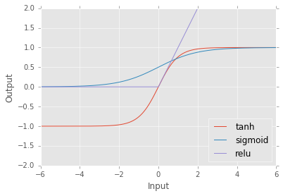
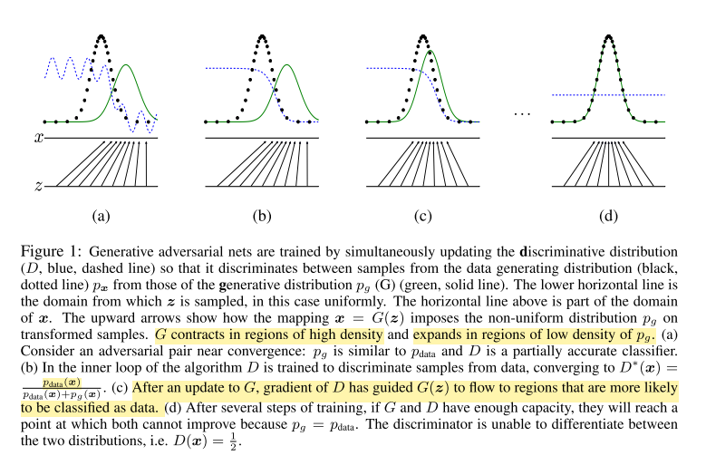

# Glossary

This glossary tries to index the terms used throughout the course.  This is a work in progress and contributions are welcomed.

# Table of Contents

<!-- MarkdownTOC -->

- [1x1 Convolutions](#1x1-convolutions)
- [1-D Gaussian Kernel](#1-d-gaussian-kernel)
- [2-D Gaussian Kernel](#2-d-gaussian-kernel)
- [Activation Function](#activation-function)
- [Accuracy](#accuracy)
- [Adversarial Network](#adversarial-network)
- [Adversarial Training](#adversarial-training)
- [ANN](#ann)
- [Artificial Intelligence](#artificial-intelligence)
- [Artificial Neural Network](#artificial-neural-network)
- [Autoencoders](#autoencoders)
- [Back-prop](#back-prop)
- [Back-propagation](#back-propagation)
- [Back-propagation Through Time](#back-propagation-through-time)
- [Batch Dimension](#batch-dimension)
- [Batch Normalization](#batch-normalization)
- [Batches](#batches)
- [Bias](#bias)
- [Blur](#blur)
- [Celeb Dataset](#celeb-dataset)
- [Char-RNN](#char-rnn)
- [Character Language Model](#character-language-model)
- [Checkpoint](#checkpoint)
- [Classification](#classification)
- [Classification Network](#classification-network)
- [Clip](#clip)
- [Complex Cell](#complex-cell)
- [Computational Graph](#computational-graph)
- [Computer Vision](#computer-vision)
- [Conditional Probability](#conditional-probability)
- [Content Features](#content-features)
- [Content Loss](#content-loss)
- [Context Managers](#context-managers)
- [Convolution](#convolution)
- [Convolutional Autoencoder](#convolutional-autoencoder)
- [Convolutional Networks](#convolutional-networks)
- [Convolve](#convolve)
- [Covariance](#covariance)
- [Covariance Matrix](#covariance-matrix)
- [Cost](#cost)
- [Cross Entropy](#cross-entropy)
- [Cross Validation](#cross-validation)
- [Dataset](#dataset)
- [Dataset Augmentation](#dataset-augmentation)
- [DCGAN](#dcgan)
- [Decoder](#decoder)
- [Deep Convolutional Networks](#deep-convolutional-networks)
- [Deep Convolutional Generative Adversarial Network](#deep-convolutional-generative-adversarial-network)
- [Deep Dream](#deep-dream)
- [Deep Dreaming](#deep-dreaming)
- [Deep Learning vs. Machine Learning](#deep-learning-vs-machine-learning)
- [Denoising Autoencoder](#denoising-autoencoder)
- [Deprocessing](#deprocessing)
- [Deviation](#deviation)
- [Discriminator](#discriminator)
- [Distributed Representation](#distributed-representation)
- [Dot Product](#dot-product)
- [DRAW](#draw)
- [Dropout](#dropout)
- [Early Stopping](#early-stopping)
- [Embedding](#embedding)
- [Encoder](#encoder)
- [Epoch](#epoch)
- [Equilibrium](#equilibrium)
- [Error](#error)
- [Example](#example)
- [Feed-forward Neural Network](#feed-forward-neural-network)
- [Filter](#filter)
- [Fine Tuning](#fine-tuning)
- [Forward Propagation](#forward-propagation)
- [Fully Connected](#fully-connected)
- [Gabor](#gabor)
- [GAN](#gan)
- [Gaussian](#gaussian)
- [Gaussian Kernel](#gaussian-kernel)
- [Generalized Matrix Multiplication](#generalized-matrix-multiplication)
- [Generative Adversarial Networks](#generative-adversarial-networks)
- [Generator](#generator)
- [Gradient](#gradient)
- [Gradient Clipping](#gradient-clipping)
- [Gradient Descent](#gradient-descent)
- [Graph Definition](#graph-definition)
- [Graphs](#graphs)
- [GRU](#gru)
- [Guided Hallucinations](#guided-hallucinations)
- [Hidden Layer](#hidden-layer)
- [Histogram Equalization](#histogram-equalization)
- [Histograms](#histograms)
- [Hyperparameters](#hyperparameters)
- [Image Inpainting](#image-inpainting)
- [Image Labels](#image-labels)
- [Inception Module](#inception-module)
- [Inception Network](#inception-network)
- [Inference](#inference)
- [Information Theory](#information-theory)
- [Invariances](#invariances)
- [Kernel](#kernel)
- [LAPGAN](#lapgan)
- [Laplacian Pyramid](#laplacian-pyramid)
- [Latent Encoding](#latent-encoding)
- [Latent Feature Arithmetic](#latent-feature-arithmetic)
- [Latent-Space](#latent-space)
- [Layer](#layer)
- [Learning From Data](#learning-from-data)
- [Learning Rate](#learning-rate)
- [Linear Regression](#linear-regression)
- [Loading a Pretrained Network](#loading-a-pretrained-network)
- [Local Minima/Optima](#local-minimaoptima)
- [Long Short Term Memory](#long-short-term-memory)
- [Loss](#loss)
- [LSTM](#lstm)
- [Machine Learning](#machine-learning)
- [Manifold](#manifold)
- [Matrix](#matrix)
- [Matrix Inverse](#matrix-inverse)
- [Matrix Multiplication](#matrix-multiplication)
- [Max Pooling](#max-pooling)
- [Mean](#mean)
- [Mini Batch](#mini-batch)
- [Mini Batch Gradient Descent](#mini-batch-gradient-descent)
- [MNIST](#mnist)
- [Models](#models)
- [Network](#network)
- [Network Labels](#network-labels)
- [Neural Network](#neural-network)
- [Nonlinearities](#nonlinearities)
- [Norm](#norm)
- [Normalization](#normalization)
- [Objective](#objective)
- [One-Hot Encoding](#one-hot-encoding)
- [Operations](#operations)
- [Optimization](#optimization)
- [Optimizers](#optimizers)
- [Overfitting](#overfitting)
- [Preprocess](#preprocess)
- [Preprocessing](#preprocessing)
- [Pretrained Networks](#pretrained-networks)
- [Priming](#priming)
- [Probabilistic Sampling](#probabilistic-sampling)
- [Protobuf](#protobuf)
- [Rectified Linear Unit](#rectified-linear-unit)
- [Recurrent Neural Networks](#recurrent-neural-networks)
- [Regression](#regression)
- [Regularization](#regularization)
- [Reinforcement Learning](#reinforcement-learning)
- [ReLu](#relu)
- [RNN](#rnn)
- [RL](#rl)
- [Saturation](#saturation)
- [Scalar](#scalar)
- [Sessions](#sessions)
- [Sigmoid](#sigmoid)
- [Simple Cell](#simple-cell)
- [Softmax](#softmax)
- [Softmax Layer](#softmax-layer)
- [Sparse](#sparse)
- [Standard Deviation](#standard-deviation)
- [Stochastic](#stochastic)
- [Stochastic Mini Batch Gradient Descent](#stochastic-mini-batch-gradient-descent)
- [Style Features](#style-features)
- [Style Loss](#style-loss)
- [Style Net](#style-net)
- [Supervised Learning](#supervised-learning)
- [TanH](#tanh)
- [Temperature](#temperature)
- [Tensor](#tensor)
- [Tensor Shapes](#tensor-shapes)
- [Tensorboard](#tensorboard)
- [Testing](#testing)
- [Total Variation Loss](#total-variation-loss)
- [Training](#training)
- [Training Error](#training-error)
- [Training Parameters](#training-parameters)
- [Training vs. Testing](#training-vs-testing)
- [Transpose](#transpose)
- [Unsupervised Learning](#unsupervised-learning)
- [Unsupervised vs. Supervised Learning](#unsupervised-vs-supervised-learning)
- [VAEGAN](#vaegan)
- [Validation](#validation)
- [Validation Error](#validation-error)
- [Vanishing Gradient](#vanishing-gradient)
- [Variable](#variable)
- [Variance](#variance)
- [Variational Auto-Encoding Generative Adversarial Network](#variational-auto-encoding-generative-adversarial-network)
- [Variational Autoencoders](#variational-autoencoders)
- [Variational Layer](#variational-layer)
- [Vector](#vector)
- [VGG Network](#vgg-network)
- [Xavier Initialization](#xavier-initialization)

<!-- /MarkdownTOC -->


<a name="1x1-convolutions"></a>
# 1x1 Convolutions

This defines an operation where the height and width of the kernel of a [convolution](#convolution) operation are set to 1.  This is useful because the depth dimension of the convolution operation can still be used to reduce the dimensionality (or increase it).  So for instance, if we have batch number of 100 x 100 images w/ 3 color channels, we can define a 1x1 convolution which reduces the 3 color channels to just 1 channel of information.  This is often applied before a much more expensive operation to reduce the number of overall parameters.

<a name="1-d-gaussian-kernel"></a>
# 1-D Gaussian Kernel

The image below depicts a 1-D Gaussian Kernel:


In TensorFlow, the 1-D Gaussian can be computed by specifying the two parameters, `mean` and the standard deviation, which is commonly denoted by the name `sigma`.

```python
mean = 0.0
sigma = 1.0
z = (tf.exp(tf.negative(tf.pow(x - mean, 2.0) /
                   (2.0 * tf.pow(sigma, 2.0)))) *
     (1.0 / (sigma * tf.sqrt(2.0 * 3.1415))))
```

See also the [2-D Gaussian Kernel](#2-d-gaussian-kernel).

<a name="2-d-gaussian-kernel"></a>
# 2-D Gaussian Kernel

Like the [1-D Gaussian Kernel](#1-d-gaussian-kernel), the 2-D Gaussian Kernel has its peak in the middle and reduces in value exponentially as you move outside the center.  When the 1-D Gaussian is [matrix multiplied](#matrix-multiplication) with the [matrix transpose](#matrix-transpose) of itself, the 1-D Gaussian can be depicted in 2-dimensions as such:


Following from the definition of the 1-D Gaussian Kernel, the 2-D Gaussian Kernel can be computed in TensorFlow as such:

```python
# Let's store the number of values in our Gaussian curve.
ksize = z.get_shape().as_list()[0]

# Let's multiply the two to get a 2d gaussian
z_2d = tf.matmul(tf.reshape(z, [ksize, 1]), tf.reshape(z, [1, ksize]))
```

<a name="activation-function"></a>
# Activation Function

The activation function, also known as the non-linearity, describes the non-linear operation in a Neural Network.  Neural Networks gain the power to describe very complex functions by performing series of linear + nonlinear operations.  These two series of operations, linear followed by a nonlinear operation, are typically grouped together in a single layer, and a neural network is composed of many layers.  Typical activation functions include the [sigmoid](#sigmoid), [TanH](#tanh), or [ReLu](#relu), as shown below:



This graph depicts three activation functions.  Any value on the x, horizontal axis, is transformed "nonlinearly" as the value on the y, vertical axis.

<a name="accuracy"></a>
# Accuracy

In [classification](#classification) tasks, the accuracy describes how well a network does at predicting the correct class.

In TensorFlow, we might calculate it like so, assuming we have the true output of the network in `Y`, and a predicted output in `Y_pred`:

```python
predicted_y = tf.argmax(Y_pred, 1)
actual_y = tf.argmax(Y, 1)

# We can then measure the accuracy by seeing whenever these are equal.
correct_prediction = tf.equal(predicted_y, actual_y)
accuracy = tf.reduce_mean(tf.cast(correct_prediction, "float"))
```

<a name="adversarial-network"></a>
# Adversarial Network

See [Generative Adversarial Network](#generative-adversarial-networks).

<a name="adversarial-training"></a>
# Adversarial Training

This describes the process of training a network like the [Adversarial Network](#adversarial-network).  It is usually composed of two networks whose loss functions are constructed such that they try to fool one another.  It is related to game theory in that there should be an [equilibrium](#equilibrium) that allows both models to get stronger together.  If that equilibrium is broken, meaning one of the two networks is stronger than the other, then it is difficult to continue training either of them towards anything useful.

<a name="ann"></a>
# ANN

Abbreviation of [Artificial Neural Network](#artificial-neural-network).

<a name="artificial-intelligence"></a>
# Artificial Intelligence

<a name="artificial-neural-network"></a>
# Artificial Neural Network

<a name="autoencoders"></a>
# Autoencoders

An autoencoder describes a network which [encodes](#encoder) its input to some [latent encoding](#latent-encoding) layer of smaller dimensions, and then [decodes](#decoder) this [latent layer](#latent-layer) back to the original input space dimensions.  The purpose of such a network is usually to compress the information in a large dataset such that the inner most, or the layer just following the encoder, is capable of retaining as much of the information necessary to reconstitute the original dataset.  For instance, an image of 256 x 256 x 3 dimensions may be encoded to merely 2 values describing any image's latent encoding. The decoder is then capable of taking these 2 values and creating an image resembling the original image, depending on how well the network is trained/performs.

<a name="back-prop"></a>
# Back-prop

Abbreviation of [Back-propagation](#back-propagation).

<a name="back-propagation"></a>
# Back-propagation

This describes the process of the backwards propagation of the training signal, or error, from a neural network, to each of the gradients in a network using the [chain rule of calculus](https://en.wikipedia.org/wiki/Chain_rule).  This process is used with an optimization technique such as Gradient Descent.

<a name="back-propagation-through-time"></a>
# Back-propagation Through Time


<a name="batch-dimension"></a>
# Batch Dimension

The "batch" dimension is often the first, but not necessarily the first, dimension of a [Tensor](#tensor).  For example, a 10 x 256 x 256 x 3 dimension Tensor has 10 images of 256 x 256 x 3 dimensions.  The batch dimensions indexes all the observations in a ["mini-batch"](#mini-batch), or a small subset of examples from a larger dataset.  This is used during [Mini Batch Gradient Descent](#mini-batch-gradient-descent) to train a network on the entire contents of a larger dataset.

<a name="batch-normalization"></a>
# Batch Normalization

Batch Normalization describes a technique for [regularization](#regularization) which effectively smooths the gradient updates during [back-propagation](#back-propagation).  It is suggested by the authors of the technique that it should be applied just before the [activation function](#activation-function) of a layer.

<a name="batches"></a>
# Batches

Batches describe the individual mini-batches in [mini batch gradient descent](#mini-batch-gradient-descent) used during [training](#training).

<a name="bias"></a>
# Bias

The bias describes a linear shift in weights.  

<a name="blur"></a>
# Blur

Blurring is a technique which effectively smooths a signal, reducing "high-frequencies", or sharp discontinuities in a signal.  It is often used a technique for [regularization](#regularization), for instance during [Deep Dream](#deep-dream) or [Style Net](#style-net), on the overall activations of a gradient or the final result.

<a name="celeb-dataset"></a>
# Celeb Dataset

Celeb Dataset describes a dataset of over 200,000 images of celebrity faces: http://mmlab.ie.cuhk.edu.hk/projects/CelebA.html - a popular choice of dataset for image networks as it contains a version of the dataset which has been "frontally aligned", meaning a computer vision technique was used to find the faces in various photos and align and warp them so that it looks like the faces are looking straight into the camera.  This effectively reduces the overall [invariances](#invariances) in the dataset, making it a simpler dataset to learn.

<a name="char-rnn"></a>
# Char-RNN

Char-RNN [2] implements a [Character Language Model](#character-language-model) as described in [1] capable of predicting one characters in sequence, one at a time.

[1]. Graves, A. (2013). Generating sequences with recurrent neural networks. arXiv Preprint arXiv:1308.0850, 1–43. Retrieved from http://arxiv.org/abs/1308.0850
[2]. https://github.com/karpathy/char-rnn

<a name="character-language-model"></a>
# Character Language Model

Described in [1], the basic idea is to take one character at a time and try to predict the next character in sequence. Given enough sequences, the model is capable of generating entirely new sequences all on its own.  See [Char-RNN](#char-rnn) for an example.

[1]. Graves, A. (2013). Generating sequences with recurrent neural networks. arXiv Preprint arXiv:1308.0850, 1–43. Retrieved from http://arxiv.org/abs/1308.0850

<a name="checkpoint"></a>
# Checkpoint

In TensorFlow, a checkpoint describes a model and its weights during the process of training.  These are often created every so many iterations or [epochs](#epochs) during training.

<a name="classification"></a>
# Classification

<a name="classification-network"></a>
# Classification Network

<a name="clip"></a>
# Clip

<a name="complex-cell"></a>
# Complex Cell

<a name="computational-graph"></a>
# Computational Graph

Describes the overall set of operations involved in computing a neural network, including the core operations of the neural network, its loss and optimization functions, gradients, operations involved in saving/restoring and monitoring weights.  In TensorFlow, a graph can be created like so:

```python
g = tf.Graph()
```

However, a default graph is automatically registered and can be obtained by saying:

```python
g = tf.get_default_graph()
```

And all of its operations can be listed like so:

```python
[print(op.name) for op in g.get_operations()];
```

<a name="computer-vision"></a>
# Computer Vision

<a name="conditional-probability"></a>
# Conditional Probability

<a name="content-features"></a>
# Content Features

<a name="content-loss"></a>
# Content Loss

<a name="context-managers"></a>
# Context Managers

<a name="convolution"></a>
# Convolution

A very common operation in Deep Learning is convolution. Think of it a way of filtering information.  For instance, with a [Gaussian kernel](#gaussian-kernel), convolution acts in a way that allows the Gaussian kernel to be the lens through which we'll see our data. What it does is at every location we tell it to filter, it will average the image values around it based on what the kernel's values are.  The Gaussian's kernel is basically saying, take a lot the center, a then decreasingly less as you go farther away from the center. The effect of convolving the image with this type of kernel is that the entire image will be blurred. If you would like an interactive exploration of convolution, this website is great:

http://setosa.io/ev/image-kernels/

<a name="convolutional-autoencoder"></a>
# Convolutional Autoencoder

<a name="convolutional-networks"></a>
# Convolutional Networks

A neural network which employs [convolution](#convolution).

<a name="convolve"></a>
# Convolve

The act/operation of [convolution](#convolution).  I.e. convolution is performed by convolving an image by a [kernel](#kernel). 

<a name="covariance"></a>
# Covariance

<a name="covariance-matrix"></a>
# Covariance Matrix

<a name="cost"></a>
# Cost

Cost measures the overall performance of a network and is used during optimization to train the parameters of a network.  It can sometimes be used interchangeably with [loss](#loss).  In this course, I've chosen to use cost as the final loss measure as a result of average across batches, while loss is reserved for single observation measures of loss, such as l2, l1, or cross-entropy.

<a name="cross-entropy"></a>
# Cross Entropy

Cross entropy is an [information theoretic](#information-theory) which measures the distance (term is used loosely here) between two vectors when they are probabilities.  In TensorFlow, it can be computed as:

```python
cross_entropy = -tf.reduce_sum(Y * tf.log(Y_pred + 1e-12))
```

assuming that `Y` is the "true" distribution, and `Y_pred` is a predicted distribution that is the output from a Neural Network.  This distribution should be probabilistic, meaning its sum adds to 1, and there are no negative values.  This can be achieved with a [softmax](#softmax) layer.

<a name="cross-validation"></a>
# Cross Validation

Cross validation is a common technique for [validation](#validation).

<a name="dataset"></a>
# Dataset

Datasets describe the data used for training, validating, and testing a machine learning model.  There are a ton of datasets out there that current machine learning researchers use.  For instance, http://deeplearning.net/datasets/ includes MNIST, CalTech, CelebNet, LFW, CIFAR, MS Coco, Illustration2Vec, and there are ton more. And these are primarily image based. But if you are interested in finding more, just do a quick search or drop a quick message on the forums if you're looking for something in particular.

MNIST
CalTech
CelebNet
ImageNet: http://www.image-net.org/
LFW
CIFAR10
CIFAR100
MS Coco: http://mscoco.org/home/
WLFDB: http://wlfdb.stevenhoi.com/
Flickr 8k: http://nlp.cs.illinois.edu/HockenmaierGroup/Framing_Image_Description/KCCA.html
Flickr 30k

<a name="dataset-augmentation"></a>
# Dataset Augmentation

<a name="dcgan"></a>
# DCGAN

Abbreviation of [Deep Convolutional Generative Adversarial Network](#deep-convolutional-generative-adversarial-network).

<a name="decoder"></a>
# Decoder

<a name="deep-convolutional-networks"></a>
# Deep Convolutional Networks

<a name="deep-convolutional-generative-adversarial-network"></a>
# Deep Convolutional Generative Adversarial Network

<a name="deep-dream"></a>
# Deep Dream

<a name="deep-dreaming"></a>
# Deep Dreaming

<a name="deep-learning-vs-machine-learning"></a>
# Deep Learning vs. Machine Learning

Deep Learning is a type of Machine Learning algorithm that uses Neural Networks to learn. The type of learning is "Deep" because it is composed of many layers of Neural Networks.

<a name="denoising-autoencoder"></a>
# Denoising Autoencoder

<a name="deprocessing"></a>
# Deprocessing

<a name="deviation"></a>
# Deviation

<a name="discriminator"></a>
# Discriminator

<a name="distributed-representation"></a>
# Distributed Representation

<a name="dot-product"></a>
# Dot Product

<a name="draw"></a>
# DRAW

<a name="dropout"></a>
# Dropout

<a name="early-stopping"></a>
# Early Stopping

<a name="embedding"></a>
# Embedding

An embedding typically describes a transformation of input data prior to further learning.  For instance, with language models, individual letters may be transformed to a [one-hot encoding](#one-hot-encoding) where each letter is represented by a single feature and a binary value of 0 or 1 denoting which letter it is.

<a name="encoder"></a>
# Encoder

<a name="epoch"></a>
# Epoch

<a name="equilibrium"></a>
# Equilibrium

<a name="error"></a>
# Error

<a name="example"></a>
# Example

<a name="feed-forward-neural-network"></a>
# Feed-forward Neural Network

<a name="filter"></a>
# Filter

Filter is often used in the field of Signal Processing to describe a similar idea as the [convolution](#convolution) [kernel](#kernel).

<a name="fine-tuning"></a>
# Fine Tuning

Fine tuning describes the process of loading an existing trained model and continuing the training of this model.  Often this continuation can lead to improvements in the model's performance when used alongside model improvements, training modifications, or dataset augmentation.  The continuation of the training may be on an entirely different dataset in which case it is also related to Transfer Learning.

<a name="forward-propagation"></a>
# Forward Propagation

Forward propagation, or forward prop, or fprop, describes the process of computing all nodes from the input to the outputs of a computational graph.  For instance, in an object recognition neural network, the forward prop describes all operations from all layers connected to the an input of an image all the way to the final output layer describing which object it is likely to be.

<a name="fully-connected"></a>
# Fully Connected

Fully connected, sometime denoted as affine or linear layers, are layers  which perform a matrix multiplication of an input vector.  Mathematically, a row vector, `x` is right multiplied by a matrix, `W`.

<a name="gabor"></a>
# Gabor


<a name="gan"></a>
# GAN

Abbreviation of [Generative Adversarial Networks](#generative-adversarial-networks).

<a name="gaussian"></a>
# Gaussian

<a name="gaussian-kernel"></a>
# Gaussian Kernel

<a name="generalized-matrix-multiplication"></a>
# Generalized Matrix Multiplication

<a name="generative-adversarial-networks"></a>
# Generative Adversarial Networks

This network described by [1] is composed of two networks, a [Generator](#generator) and a [Discriminator](#discriminator).  Together, they are known as the Generative Adversarial Network.  The basic idea is the generator is trying to create things which look like the training data. So for images, more images that look like the training data. The discriminator has to guess whether what its given is a real training example. Or whether its the output of the generator. By training one after another, you ensure neither are ever too strong, but both grow stronger together. The discriminator is also learning a distance function! This is pretty cool because we no longer need to measure pixel-based distance, but we learn the distance function entirely!

The Generative Adversarial Network, or GAN, for short, are in a way, very similar to autoencoders. Or at least the implementation of it is. The discriminator is a lot like the encoder part of the network, except it reduces the input down to a single value, yes or no, 0 or 1, denoting yes its a true training example, or no, it's a generated one.

And the generator network is exactly like the decoder of the autoencoder. Except, there is nothing feeding into this inner layer. It is just on its own. From whatever vector of hidden values it starts off with, it will generate a new example meant to look just like the training data. One pitfall of this model is there is no explicit encoding of an input. Meaning, you can't take an input and find what would possibly generate it. However, there are recent extensions to this model which make it more like the autoencoder framework, allowing it to do this, such as the [VAEGAN](#vaegan) model.



[1]. Goodfellow, I. J., Pouget-Abadie, J., Mirza, M., Xu, B., Warde-Farley, D., Ozair, S., … Bengio, Y. (2014). Generative Adversarial Networks, 1–9. Retrieved from http://arxiv.org/abs/1406.2661

<a name="generator"></a>
# Generator

One component of the [Generative Adversarial Network](#generative-adversarial-networks), built using a [decoder](#decoder) from a latent feature layer to a [Tensor](#tensor) of B x H x W x C images.

<a name="gradient"></a>
# Gradient

```python
import tensorflow as tf

# Let's create a simple line with a slope of 5.  The slope is also "gradient" of the line.
# The delta y / delta x = slope = gradient for this simple linear equation.
x = tf.Variable(0.0)
y = x * 5

# This is saying, give us an operation which defines the gradient of y with respect to x.
g = tf.gradients(y, x)

sess = tf.InteractiveSession()
sess.run(tf.global_variables_initializer())
g[0].eval()
# prints 5
```

<a name="gradient-clipping"></a>
# Gradient Clipping

<a name="gradient-descent"></a>
# Gradient Descent


<a name="graph-definition"></a>
# Graph Definition

<a name="graphs"></a>
# Graphs

<a name="gru"></a>
# GRU

<a name="guided-hallucinations"></a>
# Guided Hallucinations

<a name="hidden-layer"></a>
# Hidden Layer

<a name="histogram-equalization"></a>
# Histogram Equalization

<a name="histograms"></a>
# Histograms

<a name="hyperparameters"></a>
# Hyperparameters

<a name="image-inpainting"></a>
# Image Inpainting

<a name="image-labels"></a>
# Image Labels

<a name="inception-module"></a>
# Inception Module

<a name="inception-network"></a>
# Inception Network

<a name="inference"></a>
# Inference

<a name="information-theory"></a>
# Information Theory

A field of study popularized in the 1940s by Claude Shannon, Norbert Weiner, Alan Turing, et al.

<a name="invariances"></a>
# Invariances

We usually describe the factors which represent something "invariances". That just means we are trying not to vary based on some factor. We are invariant to it. For instance, an object could appear to one side of an image, or another. We call that translation invariance. Or it could be from one angle or another. That's called rotation invariance. Or it could be closer to the camera, or farther. and That would be scale invariance. There are plenty of other types of invariances, such as perspective or brightness or exposure in the case of photographic images.  Many researchers/scientists/philosophers will have other definitions of this term.

<a name="kernel"></a>
# Kernel

<a name="lapgan"></a>
# LAPGAN

<a name="laplacian-pyramid"></a>
# Laplacian Pyramid

<a name="latent-encoding"></a>
# Latent Encoding

<a name="latent-feature-arithmetic"></a>
# Latent Feature Arithmetic

<a name="latent-space"></a>
# Latent-Space

<a name="layer"></a>
# Layer

A layer is a convenience for grouping together a common set of operations.  For instance, a fully-connected layer is usually comprised of a matrix multiplication and a bias addition.  A convolution layer is comprised of a convolution with a kernel and a bias addition.

<a name="learning-from-data"></a>
# Learning From Data

<a name="learning-rate"></a>
# Learning Rate


The learning rate describes how far along the gradient we should move our parameters.

<a name="linear-regression"></a>
# Linear Regression

<a name="loading-a-pretrained-network"></a>
# Loading a Pretrained Network

<a name="local-minimaoptima"></a>
# Local Minima/Optima

<a name="long-short-term-memory"></a>
# Long Short Term Memory

<a name="loss"></a>
# Loss

The loss helps to define the training objective of a neural network (also used throughout machine learning literature such as in energy-based optimization).  The loss tries to assess the performance of a network, for instance by determining how close a prediction is to a known prediction.  Typically, the objective is to minimize the loss, though an objective could easily also be thought of as the maximization of the loss.

Typical losses for unsupervised learning are l2 or l1 losses.  The l2 loss is defined by the 2nd norm of activations.  Simply, it is the square of the values.  The l1 loss is similarly defined by the 1st norm, or the absolute value of activations.  The cross-entropy loss is typically used in [classification](#classification) tasks.  There are numerous other losses however, such as the hinge loss, log loss, ranking losses, or losses based on [adversarial processes](#adversarial-network), to name a few.  The loss is then generally summed across all possible features, and then averaged across all observations in a mini-batch to produce a single [cost](#cost) to be optimized.

The final cost is then used to [optimize](#optimization) the parameters in a neural network using an optimization algorithm such as [gradient descent](#gradient-descent) and [backpropagation](#backpropagation).

<a name="lstm"></a>
# LSTM

Abbreviation for [Long Short Term Memory](#long-short-term-memory).

<a name="machine-learning"></a>
# Machine Learning

<a name="manifold"></a>
# Manifold

<a name="matrix"></a>
# Matrix

<a name="matrix-inverse"></a>
# Matrix Inverse

<a name="matrix-multiplication"></a>
# Matrix Multiplication

<a name="max-pooling"></a>
# Max Pooling

<a name="mean"></a>
# Mean

<a name="mini-batch"></a>
# Mini Batch

<a name="mini-batch-gradient-descent"></a>
# Mini Batch Gradient Descent

<a name="mnist"></a>
# MNIST

<a name="models"></a>
# Models

<a name="network"></a>
# Network

<a name="network-labels"></a>
# Network Labels

<a name="neural-network"></a>
# Neural Network

<a name="nonlinearities"></a>
# Nonlinearities

Nonlinearities are another way to describe [activation functions](#activation-function) in a neural network.  They are called nonlinearities since its outputs are not linear transformations of an input, i.e. not directly proportional to its input.  Visually, its function is not a straight line but one with curves.

<a name="norm"></a>
# Norm

<a name="normalization"></a>
# Normalization

<a name="objective"></a>
# Objective

<a name="one-hot-encoding"></a>
# One-Hot Encoding

<a name="operations"></a>
# Operations

<a name="optimization"></a>
# Optimization

<a name="optimizers"></a>
# Optimizers

<a name="overfitting"></a>
# Overfitting

Overfitting describes what happens when a model tends to model noise more than the underlying cause of the data.  This can easily happen in neural networks as there are many parameters.  A common technique for ensuring this does not happen is to use [regularization](#regularization).

<a name="preprocess"></a>
# Preprocess

<a name="preprocessing"></a>
# Preprocessing

<a name="pretrained-networks"></a>
# Pretrained Networks

<a name="priming"></a>
# Priming

<a name="probabilistic-sampling"></a>
# Probabilistic Sampling

<a name="protobuf"></a>
# Protobuf

<a name="rectified-linear-unit"></a>
# Rectified Linear Unit

A common type of [Activation Function](#activation-function) which performs the nonlinear operation in TensorFlow as:

```python
tf.maximum(0, x)
```

It is linear except for a discontinuity at 0 and can effectively learn nonlinear patterns with less computation than a sigmoid or tanh function requires.  It can also lead to [sparse](#sparse) activations, meaning not all the weights in a network are active.

There are also many extensions to ReLus, such as Leaky ReLus, Parametric ReLus, and Noisy ReLus.

<a name="recurrent-neural-networks"></a>
# Recurrent Neural Networks

<a name="regression"></a>
# Regression

<a name="regularization"></a>
# Regularization

Regularization aids in cases of [overfitting](#overfitting), or when parameters are tuned in a way that describes noise in the data rather than an underlying cause.  This can easily happen in neural networks as there are many parameters. Some common techniques for regularizing networks include applying l2-norm penalties to weights, [dropout](#dropout), [batch normalization](#batch-normalization), and increased [mini-batch](#mini-batch) sizes.

<a name="reinforcement-learning"></a>
# Reinforcement Learning

<a name="relu"></a>
# ReLu

Abbreviation of [Rectified Linear Unit](#rectified-linear-unit).

<a name="rnn"></a>
# RNN

Abbreviation of [Recurrent Neural Network](#recurrent-neural-networks).

<a name="rl"></a>
# RL

Abbreviation of [Reinforcement Learning](#reinforcement-learning).

<a name="saturation"></a>
# Saturation

Describes what many non-linear [activation functions](#activation-function) do, by ensuring values are mostly a certain value.  In the case of [sigmoid](#sigmoid), input values are saturated to 0 or 1, whereas in [tanh](#tanh), the values are saturated at -1 or 1. Saturation can also describe what happens to "dead" neurons, whose values are mostly all the same value, either all 0s, Infinity, or NaNs.  These neurons often die or become saturated as a result of very large gradients, poor initialization, or large learning rates.

<a name="scalar"></a>
# Scalar

A scalar is simply a single value, e.g. -2, 0, 1, 1.4, 500.

<a name="sessions"></a>
# Sessions

In order to actually compute anything in TensorFlow, we use a `tf.Session` to manage and evaluating the [computational graph](#computational-graph), `tf.Graph`.

<a name="sigmoid"></a>
# Sigmoid

The sigmoid function is a common [activation function](#activation-function): `y = 1 / (1 + exp(-x))`.  It has the range of [0, 1] and is a s-shaped function.  In TensorFlow, it can be used by calling `tf.nn.sigmoid`.

<a name="simple-cell"></a>
# Simple Cell

<a name="softmax"></a>
# Softmax

\begin{equation}
softmax(x_i) = \frac{e^{x_i}}{\sum_{j=1}^{k}{e^{x_j}}}
\end{equation}

The **softmax** scales a vector exponentially and ensures that its sum adds to 1.  This has the effect of rescaling any vector such that it can be treated as a probability distribution over possible classes.  It should be used with a loss that allows you to measure the loss of a probability distribution such as [cross entropy](#cross-entropy).  In Tensorflow, there are at least 2 ways to use the softmax layer. 

1. Directly with `tf.nn.softmax`, on the outputs of a [sigmoid](#sigmoid) transformation (ensuring values are between 0-1).

2. While computing the [cross entropy](#cross-entropy) given unscaled outputs (i.e. no non-linearity such as a [sigmoid](#sigmoid) is computed) using `tf.nn.softmax_cross_entropy_with_logits`.

<a name="softmax-layer"></a>
# Softmax Layer

A transformation of a batch number of features using a [Softmax](#softmax) transformation.

<a name="sparse"></a>
# Sparse

<a name="standard-deviation"></a>
# Standard Deviation

<a name="stochastic"></a>
# Stochastic

<a name="stochastic-mini-batch-gradient-descent"></a>
# Stochastic Mini Batch Gradient Descent

<a name="style-features"></a>
# Style Features

<a name="style-loss"></a>
# Style Loss

<a name="style-net"></a>
# Style Net

<a name="supervised-learning"></a>
# Supervised Learning

In probabilistic terms, a supervised learning algorithm tries to optimize the joint probability `p(x, y)` or the conditional probability `p(y|x)`.  For example, it may try to optimize the prediction of an image label given the pixels of the image.

<a name="tanh"></a>
# TanH

<a name="temperature"></a>
# Temperature

<a name="tensor"></a>
# Tensor

A Tensor describes a geometric object which is an N-dimensional array.  For instance, a 1-dimensional Tensor is also known as a Vector.  A 2-dimensional Tensor is also known as a Matrix.  Thinking of Tensors as geometric objects affords us to think about linear relationships between Tensors, such as the dot product or the cross product.  In TensorFlow, Tensors are described by a name which states what operation they are the result of, their shape, e.g. `(100, 100)`, and their `dtype`, such as `tf.float32` or `tf.int32`.

<a name="tensor-shapes"></a>
# Tensor Shapes

A Tensor's shape describes the number of elements in each dimension.  It is similar to a numpy array's shape and can be accessed as `x.get_shape()` or `x.get_shape().as_list()`.

<a name="tensorboard"></a>
# Tensorboard

Tensorboard is a web application provided by Tensorflow for monitoring the training of a computational graph.  It requires you to write Summary objects such as `tf.scalar_summary` or `tf.histogram_summary`, and to create a `tf.train.SummaryWriter` for writing summaries to a given destination, e.g. `path/to/log-directory`.  It can then be started using the command line like so: `tensorboard --logdir=path/to/log-directory` and then accessed using the webbrowser at the default port of 6006, e.g. `http://localhost:6006`.

<a name="testing"></a>
# Testing

<a name="total-variation-loss"></a>
# Total Variation Loss

<a name="training"></a>
# Training

<a name="training-error"></a>
# Training Error

<a name="training-parameters"></a>
# Training Parameters

<a name="training-vs-testing"></a>
# Training vs. Testing

<a name="transpose"></a>
# Transpose

<a name="unsupervised-learning"></a>
# Unsupervised Learning

In probabilistic terms, unsupervised learning tries to model `p(x)`, the probability of observing some data `x`.  

<a name="unsupervised-vs-supervised-learning"></a>
# Unsupervised vs. Supervised Learning

Machine learning research in deep networks generally performs one of two types of learning. You either have a lot of data and you want the computer to reason about it, maybe to encode the data using less data, and just explore what patterns there might be. That's useful for clustering data, reducing the dimensionality of the data, or even for generating new data. That's generally known as unsupervised learning. In the supervised case, you actually know what you want out of your data. You have something like a label or a class that is paired with every single piece of data.  There are other types of learning, such as reinforcement learning, though these are not discussed in this course.

<a name="vaegan"></a>
# VAEGAN

<a name="validation"></a>
# Validation

Validation describes a method of measuring the performance of an algorithm.  There are many kinds of validation, for instance k-fold validation or crossfold validation.  In Deep Learning, there is often enough data to perform a simpler form of validation which holds out portions of a dataset for training, validation, and testing.  While a model is being trained, only the portion of the dataset designated for training, e.g. 80% of the entire dataset, is used.  While training the model in iterations, another portion of the dataset is used to monitor the progress of training, e.g. 10%.  Finally, once the model is finished training, the last portion of the dataset can be used to assess a final test performance.  Ideally, the process is repeated over a number of k-folds, e.g. k=2 or k=5, such that every k-partitions of a dataset is used as a test.  However, Deep Learning datasets are often large enough to assume that a test partition has enough variance, and in practice, it is also often far too painful to consider the idea of training a model in k-folds.

<a name="validation-error"></a>
# Validation Error

Validation error describes the error of a validation set during training.  Ideally, this error stays close to the training error, and both drop over more and more iterations.  If this is not the case, for instance if the training error continues to drop but not the validation error, it is possible the model is [overfitting](#overfitting).  See [validation](#validation) for more details.

<a name="vanishing-gradient"></a>
# Vanishing Gradient

Describes the problem with deep networks whose gradients "vanish" or become closer and closer to 0, eventually becoming 0.  This happens as the process of [backpropagation](#backpropagation) requires gradients to be chained together and multiplied together.  If a gradient is very small, then the gradients can easily be multiplied in a way that the gradient gets smaller and smaller as it is propagated through each layer, eventually becoming 0.  The reverse to this is the [exploding gradient](#exploding-gradient), which is when the gradient is above 1, thus quickly exploding to infinity in a similar manner.

Some solutions to this problem have been addressed for recurrent neural networks such as using gating mechanisms (e.g., see [LSTM](#LSTM) or [GRU](#GRU)).  Other solutions include making the network shallower or using [batch normalization](#batch-normalization).

<a name="variable"></a>
# Variable

<a name="variance"></a>
# Variance

<a name="variational-auto-encoding-generative-adversarial-network"></a>
# Variational Auto-Encoding Generative Adversarial Network

<a name="variational-autoencoders"></a>
# Variational Autoencoders

<a name="variational-layer"></a>
# Variational Layer

<a name="vector"></a>
# Vector

<a name="vgg-network"></a>
# VGG Network

<a name="xavier-initialization"></a>
# Xavier Initialization

Describes a weight initialization procedure described by [1] which sets the weights of a M x N matrix to uniformly sampled values between the range of [-sqrt(6) / sqrt(M + N), sqrt(6) / sqrt(M + N)].

[1]. Glorot and Bengio 2010

---

Thanks to Golan Levin for [suggesting the idea](https://twitter.com/golan/status/798619471199883264).
