# Session 2: Training a network w/ Tensorflow
<p class='lead'>
Creative Applications of Deep Learning with Google's Tensorflow<br />
Parag K. Mital<br />
Kadenze, Inc.<br />
</p>

<a name="learning-goals"></a>
# Learning Goals

* The basic components of a neural network
* How to use gradient descent to optimize parameters of a neural network
* How to create a neural network for performing regression

<!-- MarkdownTOC autolink=true autoanchor=true bracket=round -->

- [Introduction](#introduction)
- [Gradient Descent](#gradient-descent)
    - [Defining Cost](#defining-cost)
    - [Minimizing Error](#minimizing-error)
    - [Backpropagation](#backpropagation)
    - [Extra details for notebook only](#extra-details-for-notebook-only)
    - [Local Minima/Optima](#local-minimaoptima)
    - [Learning Rate](#learning-rate)
- [Creating a Neural Network](#creating-a-neural-network)
    - [Defining Cost](#defining-cost-1)
    - [Training Parameters](#training-parameters)
    - [Training vs. Testing](#training-vs-testing)
    - [Stochastic and Mini Batch Gradient Descent](#stochastic-and-mini-batch-gradient-descent)
    - [Input's Representation](#inputs-representation)
    - [Over vs. Underfitting](#over-vs-underfitting)
    - [Introducing Nonlinearities / Activation Function](#introducing-nonlinearities--activation-function)
    - [Going Deeper](#going-deeper)
- [Image Inpainting](#image-inpainting)
    - [Description](#description)
    - [Building the Network](#building-the-network)
    - [Training](#training)
- [Homework:](#homework)
- [Reading:](#reading)

<!-- /MarkdownTOC -->

<a name="introduction"></a>
# Introduction

In this session we're going to take everything we've learned about Graphs, Sessions, Operations, and Tensors and use them all to form a neural network.  We're going to learn how we can use data and something called gradient descent to teach the network what the values of the parameters of this network should be.

In the last session, we saw how to normalize a dataset, using the dataset's mean and standard deviation.  While this seemed to reveal some interesting representations of our dataset, it left us with a lot more to explain.  In the case of faces, it really seemed to explain more about the background than the actual faces.  For instance, it wasn't able to describe the differences between different races, gender, expressions, hair style, hair color, or the other many various differences that one might be interested in.

What we're really interested in is letting the computer figure out what representations it needs in order to better describe the data and some objective that we've defined.  That is the fundamental idea behind machine learning: letting the machine learn from the data.  In this session, we're going to start to see how to do that.

Before we get into the details, I'm going to go over some background on gradient descent and the different components of a neural network.  If you're comfortable with all of this, please feel free to skip ahead.

<a name="gradient-descent"></a>
# Gradient Descent

Whenever we create a neural network, we have to define a set of operations.  These operations try to take us from some input to some output.  For instance, the input might be an image, or frame of a video, or text file, or sound file.  The operations of the network are meant to transform this input data into something meaningful that we want the network to learn about.

Initially, all of the parameters of the network are random.  So whatever is being output will also be random.  But let's say we need it to output something specific about the image.  To teach it to do that, we're going to use something called "Gradient Descent".  Simply, Gradient descent is a way of optimizing a set of parameters.

Let's say we have a few images, and know that given a certain image, when I feed it through a network, its parameters should help the final output of the network be able to spit out the word "orange", or "apple", or some appropriate *label* given the image of that object.  The parameters should somehow accentuate the "orangeness" of my image.  It probably will be able to transform an image in away that it ends up having high intensities for images that have the color orange in them, and probably prefer images that have that color in a fairly round arrangement.

Rather than hand crafting all of the possible ways an orange might be manifested, we're going to learn the best way to optimize its objective: separating oranges and apples.  How can we teach a network to learn something like this?

<a name="defining-cost"></a>
## Defining Cost

Well we need to define what "best" means.  In order to do so, we need a measure of the "error".  Let's continue with the two options we've been using: orange, or apple.  I can represent these as 0 and 1 instead.

I'm going to get a few images of oranges, and apples, and one by one, feed them into a network that I've randomly initialized.  I'll then filter the image, by just multiplying every value by some random set of values.  And then I'll just add up all the numbers, and then squash the result in a way that means I'll only ever get 0 or 1.  So I put in an image, and I get out a 0 or 1.  Except, the parameters of my network are totally random, and so my network will only ever spit out random 0s or 1s.  How can I get this random network to know when to spit out a 0 for images of oranges, and a 1 for images of apples?

We do that by saying, if the network predicts a 0 for an orange, then the error is 0.  If the network predicts a 1 for an orange, then the error is 1.  And vice-versa for apples.  If it spits out a 1 for an apple, then the error is 0.  If it spits out a 0 for an apple, then the error is 1.  What we've just done is create a function which describes error in terms of our parameters:

Let's write this another way:

\begin{align}
\text{error} = \text{network}(\text{image}) - \text{true_label}
\end{align}

where

\begin{align}
\text{network}(\text{image}) = \text{prediected_label}
\end{align}

More commonly, we'll see these components represented by the following letters:

\begin{align}
E = f(X) - y
\end{align}

Don't worry about trying to remember this equation.  Just see how it is similar to what we've done with the oranges and apples.  `X` is generally the input to the network, which is fed to some network, or a function $f$, which we know should output some label `y`.  Whatever difference there is between what it should output, y, and what it actually outputs, $f(x)$ is what is different, or error, $E$.


<a name="minimizing-error"></a>
## Minimizing Error

Instead of feeding one image at a time, we're going to feed in many.  Let's say 100.  This way, we can see what our network is doing on average.  If our error at the current network parameters is e.g. 50/100, we're correctly guessing about 50 of the 100 images.

Now for the crucial part.  If we move our network's parameters a tiny bit and see what happens to our error, we can actually use that knowledge to find smaller errors.  Let's say the error went up after we moved our network parameters.  Well then we know we should go back the way we came, and try going the other direction entirely.  If our error went down, then we should just keep changing our parameters in the same direction.  The error provides a "training signal" or a measure of the "loss" of our network.  You'll often hear anyone number of these terms to describe the same thing, "Error", "Cost", "Loss", or "Training Signal'.  That's pretty much gradient descent in a nutshell.  Of course we've made a lot of assumptions in assuming our function is continuous and differentiable.  But we're not going to worry about that, and if you don't know what that means, don't worry about it.

<a name="backpropagation"></a>
## Backpropagation

To summarize, Gradient descent is a simple but very powerful method for finding smaller measures of error by following the negative direction of its gradient.  The gradient is just saying, how does the error change at the current set of parameters?

One thing I didn't mention was how we figure out what the gradient is.  In order to do that, we use something called backpropagation.  When we pass as input something to a network, it's doing what's called forward propagation.  We're sending an input and multiplying it by every weight to an expected output.  Whatever differences that output has with the output we wanted it to have, gets *backpropagated* to every single parameter in our network.  Basically, backprop is a very effective way to find the gradient by simply multiplying many partial derivatives together.  It uses something called the chain rule to find the gradient of the error with respect to every single parameter in a network, and follows this error from the output of the network, all the way back to the input.

While the details won't be necessary for this course, we will come back to it in later sessions as we learn more about how we can use both backprop and forward prop to help us understand the inner workings of deep neural networks.

If you are interested in knowing more details about backprop, I highly recommend both Michael Nielsen's online Deep Learning book:

http://neuralnetworksanddeeplearning.com/

and Yoshua Bengio's online book:

http://www.deeplearningbook.org/

<a name="extra-details-for-notebook-only"></a>
## Extra details for notebook only

To think about this another way, the definition of a linear function is written like so:

\begin{align}
y = mx + b
\end{align}

The slope, or gradient of this function is $m$ everywhere.  It's describing how the function changes with different network parameters.  If I follow the negative value of $m$, then I'm going down the slope, towards smaller values.

But not all functions are linear.  Let's say the error was something like a parabola:

\begin{align}
y(x) = x^2
\end{align}

That just says, there is a function y, which takes one parameter, $x$, and this function just takes the value of $x$ and multiplies it by itself, or put another way, it outputs $x^2$.  Let's start at the minimum.  At $x = 0$, our function $y(0) = 0$.  Let's try and move a random amount, and say we end up at $1$.  So at $x = 1$, we know that our function went up from $y(0) = 0$ to $y(1) = 1$.  The change in $y = 1$.  The change in $x = 1$.  So our slope is:

\begin{align}
\frac{\text{change in } y}{\text{change in } x} = \frac{(y(1) - y(0)}{(1 - 0)} = \frac{1}{1} = 1
\end{align}

If we go in the negative direction of this, $x = x - 1$, we get back to 0, our minimum value.

If you try this process for any value and you'll see that if you keep going towards the negative slope, you go towards smaller values.

You might also see this process described like so:

\begin{align}
\theta = \theta - \eta \cdot \nabla_\theta J( \theta)
\end{align}

That's just saying the same thing really.  We're going to update our parameters, commonly referred to by $\theta$, by finding the gradient, $\nabla$ with respect to parameters $\theta$, $\nabla_\theta$, of our error, $J$, and moving down the negative direction of it: $- \eta \cdot \nabla_\theta J( \theta)$.  The $\eta$ is just a parameter also known as the learning rate, and it describes how far along this gradient we should travel, and we'll typically set this value from anywhere between 0.01 to 0.00001.

<a name="local-minimaoptima"></a>
## Local Minima/Optima

Before we start, we're going to need some library imports:


```python
# imports
%matplotlib inline
# %pylab osx
import os
import tensorflow as tf
import numpy as np
import matplotlib.pyplot as plt
import matplotlib.colors as colors
import matplotlib.cm as cmx
plt.style.use('ggplot')
```

One pitfall of gradient descent is that some functions contain "minima", which is another way of saying a trough, or a concave point, or put another way, a dip in a function.

Let's say, purely for illustration, that our cost function looked like:


```python
fig = plt.figure(figsize=(10, 6))
ax = fig.gca()
x = np.linspace(-1, 1, 200)
hz = 10
cost = np.sin(hz*x)*np.exp(-x)
ax.plot(x, cost)
ax.set_ylabel('Cost')
ax.set_xlabel('Some Parameter')
```


    <matplotlib.text.Text at 0x110a5aa58>


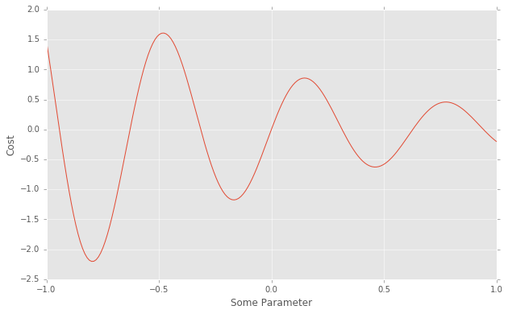


We'll never really ever be able to see our entire cost function like this.  If we were able to, we'd know exactly what parameter we should use.  So we're just imagining that as any parameters in our network change, this is how cost would change.  Since we know the value of the cost everywhere, we can easily describe the gradient using `np.diff`, which will just measure the difference between every value.  That's a good approximation of the gradient for this illustration at least.


```python
gradient = np.diff(cost)
```

If we follow the negative gradient of this function given some randomly intialized parameter and a learning rate:


```python
fig = plt.figure(figsize=(10, 6))
ax = fig.gca()
x = np.linspace(-1, 1, 200)
hz = 10
cost = np.sin(hz*x)*np.exp(-x)
ax.plot(x, cost)
ax.set_ylabel('Cost')
ax.set_xlabel('Some Parameter')
n_iterations = 500
cmap = plt.get_cmap('coolwarm')
c_norm = colors.Normalize(vmin=0, vmax=n_iterations)
scalar_map = cmx.ScalarMappable(norm=c_norm, cmap=cmap)
init_p = 120#np.random.randint(len(x)*0.2, len(x)*0.8)
learning_rate = 1.0
for iter_i in range(n_iterations):
    init_p -= learning_rate * gradient[init_p]
    ax.plot(x[init_p], cost[init_p], 'ro', alpha=(iter_i + 1) / n_iterations, color=scalar_map.to_rgba(iter_i))
```

    /Users/pkmital/.pyenv/versions/3.4.0/Python.framework/Versions/3.4/lib/python3.4/site-packages/ipykernel/__main__.py:17: VisibleDeprecationWarning: using a non-integer number instead of an integer will result in an error in the future
    /Users/pkmital/.pyenv/versions/3.4.0/Python.framework/Versions/3.4/lib/python3.4/site-packages/ipykernel/__main__.py:16: VisibleDeprecationWarning: using a non-integer number instead of an integer will result in an error in the future


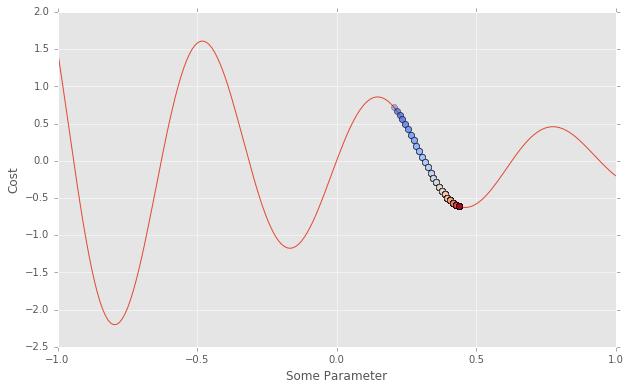


What this would mean is depending on where our random initialization of weights began, our final cost might end up being somewhere around -0.5.  This is a local minima.  It is, based on its surroundings, a minima.  But it is not the global minima.  In fact there are a few other possible places the network could have ended up, if our initialization led us to another point first, meaning our final cost would have been different.

This illustration is just for a single parameter... but our networks will often have millions of parameters... I'll illustrate the same idea with just two parameters to give you a sense of how quickly the problem becomes very difficult.


```python
from mpl_toolkits.mplot3d import axes3d
from matplotlib import cm
fig = plt.figure(figsize=(10, 6))
ax = fig.gca(projection='3d')
x, y = np.mgrid[-1:1:0.02, -1:1:0.02]
X, Y, Z = x, y, np.sin(hz*x)*np.exp(-x)*np.cos(hz*y)*np.exp(-y)
ax.plot_surface(X, Y, Z, rstride=2, cstride=2, alpha=0.75, cmap='jet', shade=False)
ax.set_xlabel('Some Parameter 1')
ax.set_ylabel('Some Parameter 2')
ax.set_zlabel('Cost')
# ax.axis('off')
```


    <matplotlib.text.Text at 0x1114ee400>


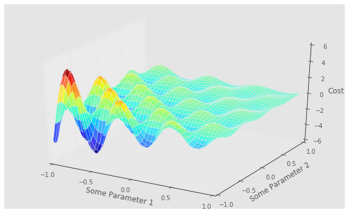


It turns out that in practice, as the number of your parameters grows, say to a million, then finding a local minima will more often than not turn out to be very good minima.  That's good news for deep networks as we'll often work with that many parameters.

<a name="learning-rate"></a>
## Learning Rate

Another aspect of learning what our parameters should be, is how far along the gradient we should move our parameters?  That is also known as `learning_rate`.  Let's see what happens for different values of our learning rate:


```python
fig, axs = plt.subplots(1, 3, figsize=(20, 6))
for rate_i, learning_rate in enumerate([0.01, 1.0, 500.0]):
    ax = axs[rate_i]
    x = np.linspace(-1, 1, 200)
    hz = 10
    cost = np.sin(hz*x)*np.exp(-x)
    ax.plot(x, cost)
    ax.set_ylabel('Cost')
    ax.set_xlabel('Some Parameter')
    ax.set_title(str(learning_rate))
    n_iterations = 500
    cmap = plt.get_cmap('coolwarm')
    c_norm = colors.Normalize(vmin=0, vmax=n_iterations)
    scalar_map = cmx.ScalarMappable(norm=c_norm, cmap=cmap)
    init_p = 120#np.random.randint(len(x)*0.2, len(x)*0.8)
    for iter_i in range(n_iterations):
        init_p -= learning_rate * gradient[init_p]
        ax.plot(x[init_p], cost[init_p], 'ro', alpha=(iter_i + 1) / n_iterations, color=scalar_map.to_rgba(iter_i))
```

    /Users/pkmital/.pyenv/versions/3.4.0/Python.framework/Versions/3.4/lib/python3.4/site-packages/ipykernel/__main__.py:18: VisibleDeprecationWarning: using a non-integer number instead of an integer will result in an error in the future
    /Users/pkmital/.pyenv/versions/3.4.0/Python.framework/Versions/3.4/lib/python3.4/site-packages/ipykernel/__main__.py:17: VisibleDeprecationWarning: using a non-integer number instead of an integer will result in an error in the future


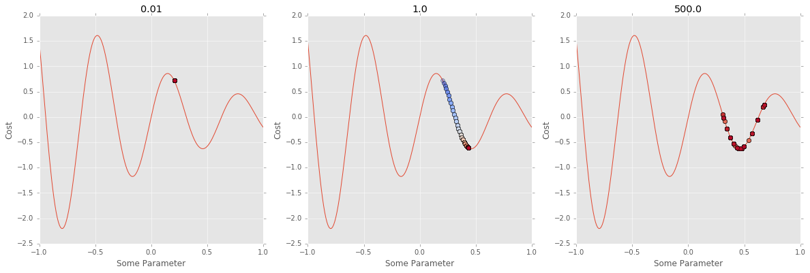


In the first case, our learning rate was way too small.  It looks like we didn't manage to get any better cost than where we started!  In the second case, just right.  In the third case, our learning rate was too large.  Meaning, we overshot our minima, and moved past it.  So our cost has the effect of going up and down, instead of just going down like in the second case.

We'll learn more tricks for changing this landscape to be a bit more concave, reducing the number of local minima by regularizing the landscape through many different extensions to this same basic idea of following the negative slope of our gradient.  Before we can get into them we'll need to learn how to create a neural network.

<a name="creating-a-neural-network"></a>
# Creating a Neural Network

Let's try a simple example network.  We're going try to find a mapping of an input `X` to an output `y`, just like in our example of mapping an input image to either a 0 or 1.


```python
# Let's create some toy data

# We are going to say that we have seen 1000 values of some underlying representation that we aim to discover
n_observations = 1000

# Instead of having an image as our input, we're going to have values from -3 to 3.  This is going to be the input to our network.
xs = np.linspace(-3, 3, n_observations)

# From this input, we're going to teach our network to represent a function that looks like a sine wave.  To make it difficult, we are going to create a noisy representation of a sine wave by adding uniform noise.  So our true representation is a sine wave, but we are going to make it difficult by adding some noise to the function, and try to have our algorithm discover the underlying cause of the data, which is the sine wave without any noise.
ys = np.sin(xs) + np.random.uniform(-0.5, 0.5, n_observations)
plt.scatter(xs, ys, alpha=0.15, marker='+')
```


    <matplotlib.collections.PathCollection at 0x111499978>


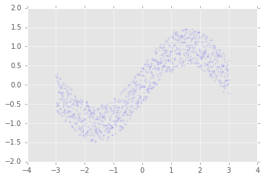


So now we can see that there is a sine wave looking thing but it's really noisy.  We want to train a network to say, given any value on the $x$ axis, tell me what the value should be on the $y$ axis.  That is the fundamental idea of regression.  Predicting some continuous output value given some continuous input value.

<a name="defining-cost-1"></a>
## Defining Cost

We're going to use tensorflow to train our first network:


```python
# variables which we need to fill in when we are ready to compute the graph.
# We'll pass in the values of the x-axis to a placeholder called X.
X = tf.placeholder(tf.float32, name='X')

# And we'll also specify what the y values should be using another placeholder, y.
Y = tf.placeholder(tf.float32, name='Y')
```

Now for parameters of our network.  We're going to transform our x values, just like we did with an image and filtering it.  In order to do that, we're going to multiply the value of x by some unknown value.  Pretty simple.  So what that lets us do is scale the value coming in.  We'll also allow for a simple shift by adding another number.  That lets us move the range of values to any new position.

But we need an initial value for our parameters.  For that, we're going to use values close to 0 using a gaussian function:


```python
sess = tf.InteractiveSession()
n = tf.random_normal([1000]).eval()
plt.hist(n)
```


    (array([  25.,   72.,  144.,  208.,  218.,  175.,  109.,   36.,   10.,    3.]),
     array([-2.53853273, -1.93898957, -1.3394464 , -0.73990324, -0.14036007,
             0.4591831 ,  1.05872626,  1.65826943,  2.2578126 ,  2.85735576,
             3.45689893]),
     <a list of 10 Patch objects>)


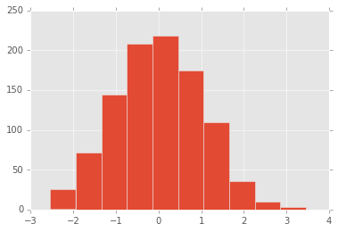


In order to do that, we can use the tensorflow `random_normal` function.  If we ask for 1000 values and then plot a histogram of the values, we can see that the values are centered around 0 and are mostly between -3 and 3.  For neural networks, we will usually want the values to start off much closer to 0.  To do that, we can control the standard deviation like so:


```python
n = tf.random_normal([1000], stddev=0.1).eval()
plt.hist(n)
```


    (array([   5.,   20.,   81.,  223.,  261.,  254.,  107.,   40.,    8.,    1.]),
     array([-0.34643096, -0.27188794, -0.19734492, -0.1228019 , -0.04825888,
             0.02628414,  0.10082716,  0.17537018,  0.2499132 ,  0.32445622,
             0.39899924]),
     <a list of 10 Patch objects>)


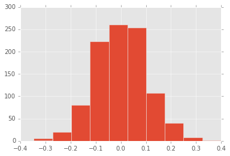


```python
# To create the variables, we'll use tf.Variable, which unlike a placeholder, does not require us to define the value at the start of a run/eval.  It does need an initial value, which we'll give right now using the function tf.random_normal.  We could also pass an initializer, which is simply a function which will call the same function.  We'll see how that works a bit later.  In any case, the random_normal function just says, give me a random value from the "normal" curve.  We pass that value to a tf.Variable which creates a tensor object.
W = tf.Variable(tf.random_normal([1], dtype=tf.float32, stddev=0.1), name='weight')

# For bias variables, we usually start with a constant value of 0.
B = tf.Variable(tf.constant([1], dtype=tf.float32), name='bias')

# Now we can scale our input placeholder by W, and add our bias, b.
Y_pred = X * W + B
```

We're going to use gradient descent to learn what the best value of `W` and `b` is.  In order to do that, we need to know how to measure what the `best` is.  Let's think about that for a moment.  What is it we're trying to do?  We're trying to transform a value coming into the network, `x`, which ranges from values of -3 to 3, to match a known value, `Y`, which should be a sine wave which ranges from -1 to 1.  So any value into the network should make it seem like the network *represents* a sine wave.  Well we know what a sine wave should be.  We can just use python to calculate it for us.  We just need a function that measures distance:


```python
# this function will measure the absolute distance, also known as the l1-norm
def distance(p1, p2):
    return tf.abs(p1 - p2)
```


```python
# and now we can take the output of our network and our known target value
# and ask for the distance between them
cost = distance(Y_pred, tf.sin(X))
```

This function is just saying, give me the distance from the predicted value to the assumed underlying sine wave value.  But let's say this was some natural occuring data in the world.  Or a more complex function, like an image of oranges or apples.  We don't know what the function is that determines whether we perceive an image as an apple or orange.


```python
# cost = distance(Y_pred, ?)
```

But we do have a limited set of data that says what a given input *should* output.  That means we can still learn what the function might be based on the data.

So instead of our previous cost function, we'd have:


```python
cost = distance(Y_pred, Y)
```

where `Y` is the *true* Y value.

Now it doesn't matter what the function is.  Our cost will measure the difference to the value we have for the input, and try to find the underlying function.  Lastly, we need to sum over every possible observation our network is fed as input.  That's because we don't give our network 1 `x` value at a time, but generally will give it 50-100 or more examples at a time.


```python
cost = tf.reduce_mean(distance(Y_pred, Y))
```

<a name="training-parameters"></a>
## Training Parameters

Let's see how we can learn the parameters of this simple network using a tensorflow optimizer.


```python
optimizer = tf.train.GradientDescentOptimizer(learning_rate=0.01).minimize(cost)
```

<TODO: Describe Train/Test sets, use test set to visualize rest of number line>

We tell the optimizer to minimize our `cost` variable which measures the distance between the prediction and actual `Y` value.  The optimizer knows how to calculate the gradient and follow it in the negative direction to find the smallest value, and handles updating all variables!

We now just need to iteratively run the optimizer, just like we would run/eval any other part of our tensorflow graph.


```python
# We create a session to use the graph
n_iterations = 500

# Plot the true data distribution
fig, ax = plt.subplots(1, 1)
ax.scatter(xs, ys, alpha=0.15, marker='+')
with tf.Session() as sess:
    # Here we tell tensorflow that we want to initialize all
    # the variables in the graph so we can use them
    # This will set `W` and `b` to their initial random normal value.
    sess.run(tf.initialize_all_variables())

    # We now run a loop over epochs
    prev_training_cost = 0.0
    for it_i in range(n_iterations):
        sess.run(optimizer, feed_dict={X: xs, Y: ys})
        training_cost = sess.run(cost, feed_dict={X: xs, Y: ys})

        # every 10 iterations
        if it_i % 10 == 0:
            # let's plot the x versus the predicted y
            ys_pred = Y_pred.eval(feed_dict={X: xs}, session=sess)

            # We'll draw points as a scatter plot just like before
            # Except we'll also scale the alpha value so that it gets
            # darker as the iterations get closer to the end
            ax.plot(xs, ys_pred, 'k', alpha=it_i / n_iterations)
            fig.show()
            plt.draw()

            # And let's print our training cost: mean of absolute differences
            print(training_cost)

        # Allow the training to quit if we've reached a minimum
        if np.abs(prev_training_cost - training_cost) < 0.000001:
            break

        # Keep track of the training cost
        prev_training_cost = training_cost
```

    Exception ignored in: <bound method InteractiveSession.__del__ of <tensorflow.python.client.session.InteractiveSession object at 0x1065377b8>>
    Traceback (most recent call last):
      File "/Users/pkmital/.pyenv/versions/3.4.0/Python.framework/Versions/3.4/lib/python3.4/site-packages/tensorflow/python/client/session.py", line 171, in __del__
        self.close()
      File "/Users/pkmital/.pyenv/versions/3.4.0/Python.framework/Versions/3.4/lib/python3.4/site-packages/tensorflow/python/client/session.py", line 976, in close
        self._default_session.__exit__(None, None, None)
      File "/Users/pkmital/.pyenv/versions/3.4.0/Python.framework/Versions/3.4/lib/python3.4/contextlib.py", line 66, in __exit__
        next(self.gen)
      File "/Users/pkmital/.pyenv/versions/3.4.0/Python.framework/Versions/3.4/lib/python3.4/site-packages/tensorflow/python/framework/ops.py", line 3378, in get_controller
        % type(default))
    AssertionError: Nesting violated for default stack of <class 'weakref'> objects
    /Users/pkmital/.pyenv/versions/3.4.0/Python.framework/Versions/3.4/lib/python3.4/site-packages/matplotlib/figure.py:397: UserWarning: matplotlib is currently using a non-GUI backend, so cannot show the figure
      "matplotlib is currently using a non-GUI backend, "


    1.01381
    0.938715
    0.866343
    0.795964
    0.730013
    0.669383
    0.616252
    0.571913
    0.534671
    0.504404
    0.481598
    0.464451
    0.45184
    0.442368
    0.434755
    0.428502
    0.423631
    0.419577
    0.416295
    0.413903
    0.41246
    0.41139
    0.410728
    0.410171
    0.409726
    0.409379
    0.409104
    0.408834
    0.408617
    0.408457
    0.40836
    0.4083
    0.408257
    0.408229


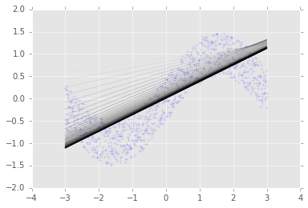


After running the code, we should see our original noisy data.  We call that the training data since it is training the network.  And we see the output of the network as a solid black line.

Now you might be thinking, wait, that looks like nothing like a sine wave... I mean it has got the general trend of the line I guess.  But it doesn't curve at all!  We're going to get into why that is in a moment.

But first, we're going to have to learn a bit more about the different between training and testing networks.

<a name="training-vs-testing"></a>
## Training vs. Testing

<TODO:>

<a name="stochastic-and-mini-batch-gradient-descent"></a>
## Stochastic and Mini Batch Gradient Descent

Now remember when I said our cost manifold would have many local minima, and that we'd learn some tricks to help us find the best one?  Well now we're ready to talk about two ways of helping with that.  One is using what are called mini-batches.  This is useful for a number of reasons.  First, it is generally impractical to look at an entire dataset.  You might have millions of images which you couldn't ever try loading all at once into a network.  Instead you would look at some random subset of them.  Second, we avoid trying to generalize our entire dataset, allowing us to navigate through more fine grained terrain.  In order to use mini batches, we simply iterate through our entire dataset, `batch_size` at a time:


```python
idxs = np.arange(100)
batch_size = 10
n_batches = len(idxs) // batch_size
for batch_i in range(n_batches):
    print(idxs[batch_i * batch_size : (batch_i + 1) * batch_size])
```

    [0 1 2 3 4 5 6 7 8 9]
    [10 11 12 13 14 15 16 17 18 19]
    [20 21 22 23 24 25 26 27 28 29]
    [30 31 32 33 34 35 36 37 38 39]
    [40 41 42 43 44 45 46 47 48 49]
    [50 51 52 53 54 55 56 57 58 59]
    [60 61 62 63 64 65 66 67 68 69]
    [70 71 72 73 74 75 76 77 78 79]
    [80 81 82 83 84 85 86 87 88 89]
    [90 91 92 93 94 95 96 97 98 99]


It turns out that this is not the best idea, because we're always looking at the same order of our dataset.  Neural networks love order.  They will pick up on any order you give it and use that to its advantage.  But the order of the data is entirely irrelevant to our problem.  In some cases, it may turn out to be exactly what we want to do.  For instance, if we want to learn about how something changes over time, like audio, or letters or words in a sequence which form sentences.  Then we will have to make sure we're sending data in a certain order.  But for now, we really want to avoid using any order.

So we'll have to randomly permute the indexes of our dataset like so:


```python
rand_idxs = np.random.permutation(idxs)
batch_size = 10
n_batches = len(rand_idxs) // batch_size
print('# of batches:', n_batches)
for batch_i in range(n_batches):
    print(rand_idxs[batch_i * batch_size : (batch_i + 1) * batch_size])
```

    # of batches: 10
    [47 46 50  8 76 63 87 66 72 11]
    [95 79 38 16 78 71 60 61 20 59]
    [ 2 48  7 67 45 27 53 73 77 57]
    [98 44 37 51 33 43 35 12 58 96]
    [85 69 82 30 31 49 88 32 83  6]
    [75 24 93 55 15 13 91 39 17 62]
    [ 4 81 86 64 40 41 90 10 70 42]
    [68 14 21 25  3 92 28 94 65 99]
    [97 74  5 52 18 54 80 89 29 84]
    [22  0  9  1 23 19 26 34 56 36]


What we've done above is look at a range of 100 possible indexes by chunking them into `batch_size` at a time.  But we've also randomized the order we've looked at them so that we aren't prioritizing learning one part of a dataset over another.

We can implement this into our previous code like so:


```python
batch_size = 1000
fig, ax = plt.subplots(1, 1)
ax.scatter(xs, ys, alpha=0.15, marker='+')
ax.set_xlim([-4, 4])
ax.set_ylim([-2, 2])
with tf.Session() as sess:
    # Here we tell tensorflow that we want to initialize all
    # the variables in the graph so we can use them
    # If we had used tf.random_normal_initializer or tf.constant_intitializer,
    # then this would have set `W` and `b` to their initial values.
    sess.run(tf.initialize_all_variables())

    # We now run a loop over epochs
    prev_training_cost = 0.0
    for it_i in range(n_iterations):
        idxs = np.random.permutation(range(len(xs)))
        n_batches = len(idxs) // batch_size
        for batch_i in range(n_batches):
            idxs_i = idxs[batch_i * batch_size: (batch_i + 1) * batch_size]
            sess.run(optimizer, feed_dict={X: xs[idxs_i], Y: ys[idxs_i]})

        training_cost = sess.run(cost, feed_dict={X: xs, Y: ys})

        if it_i % 10 == 0:
            ys_pred = Y_pred.eval(feed_dict={X: xs}, session=sess)
            ax.plot(xs, ys_pred, 'k', alpha=it_i / n_iterations)
            print(training_cost)
fig.show()
plt.draw()
```

    1.05779
    0.986123
    0.915648
    0.846516
    0.778799
    0.71353
    0.653804
    0.602119
    0.559227
    0.523675
    0.495648
    0.474023
    0.458699
    0.447444
    0.438839
    0.431773
    0.42621
    0.421696
    0.418087
    0.415061
    0.413231
    0.411967
    0.41108
    0.410476
    0.409969
    0.409551
    0.409259
    0.408984
    0.408733
    0.408536
    0.408409
    0.408328
    0.408278
    0.408242
    0.408221
    0.408211
    0.4082
    0.40819
    0.408181
    0.408177
    0.408175
    0.408173
    0.408171
    0.408169
    0.408169
    0.408169
    0.408169
    0.408169
    0.408169
    0.408169


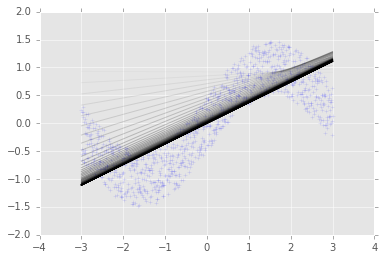


The resulting process is also know as Mini-Batch Gradient Descent, since we are taking smaller batches of our data and performing gradient descent.  Further, it is Stochastic, meaning the order of the data presented is randomized, and is also commonly referred to as Stochastic Gradient Descent.  When the two ideas are combined, we have the best of both worlds: the mini batch part which allows us to get more stable updates; and the stochastic part which allows us to move to different parts of our cost's manifold entirely.  I'll just use Gradient Descent as we'll always want it to be in batches, and to be the stochastic kind.

Let's stick all of the code necessary for training into a function so we don't have to type it out again:


```python
def train(X, Y, Y_pred, n_iterations=100, batch_size=200, learning_rate=0.02):
    cost = tf.reduce_mean(distance(Y_pred, Y))
    optimizer = tf.train.GradientDescentOptimizer(learning_rate).minimize(cost)
    fig, ax = plt.subplots(1, 1)
    ax.scatter(xs, ys, alpha=0.15, marker='+')
    ax.set_xlim([-4, 4])
    ax.set_ylim([-2, 2])
    with tf.Session() as sess:
        # Here we tell tensorflow that we want to initialize all
        # the variables in the graph so we can use them
        # This will set W and b to their initial random normal value.
        sess.run(tf.initialize_all_variables())

        # We now run a loop over epochs
        prev_training_cost = 0.0
        for it_i in range(n_iterations):
            idxs = np.random.permutation(range(len(xs)))
            n_batches = len(idxs) // batch_size
            for batch_i in range(n_batches):
                idxs_i = idxs[batch_i * batch_size: (batch_i + 1) * batch_size]
                sess.run(optimizer, feed_dict={X: xs[idxs_i], Y: ys[idxs_i]})

            training_cost = sess.run(cost, feed_dict={X: xs, Y: ys})

            if it_i % 10 == 0:
                ys_pred = Y_pred.eval(feed_dict={X: xs}, session=sess)
                ax.plot(xs, ys_pred, 'k', alpha=it_i / n_iterations)
                print(training_cost)
    fig.show()
    plt.draw()
```

To get closer to a sine wave, we're going to have to be able to do more than simply scale our input with a multiplication!  What if we had a lot more parameters?  What if we have 10 different multiplications of the input?  What does your intuition tell you?  How are 10 more multiplications combined?  1000?  A million?

<QUIZ>

Would we be able to find a good representation then?  Let's try and see how we might do that:


```python
# We're going to multiply our input by 100 values, creating an "inner layer"
# of 100 neurons.
n_neurons = 100
W = tf.Variable(tf.random_normal([1, n_neurons], stddev=0.1))

# and allow for n_neurons additions on each of those neurons
b = tf.Variable(tf.constant(0, dtype=tf.float32, shape=[n_neurons]))

# Instead of multiplying directly, we use tf.matmul to perform a
# matrix multiplication
h = tf.matmul(tf.expand_dims(X, 1), W) + b

# Create the operation to add every neuron's output
Y_pred = tf.reduce_sum(h, 1)

# Retrain with our new Y_pred
train(X, Y, Y_pred)
```

    2.00709
    1.1381
    2.04806
    2.68846
    2.75491
    2.20173
    1.78201
    1.44842
    2.29706
    1.82505


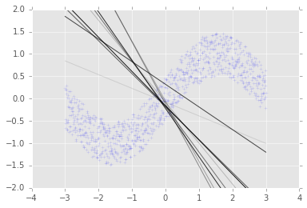


First, the training takes a lot longer!  That's because our network is much larger.  By adding 100 neurons, we've added 200 more multiplications, and 200 more additions for every observation.  Since we have 10000 observations, that's $(200 + 200) * 10000$ more computations just for computing the output, or 400 million more computations.  But that's not all.  We also need to compute the gradients of every parameter!  Having all of these extra parameters makes it much harder to find the best solution.  So as our network expands, the amount of memory and computation will grow very fast, and training becomes more difficult.

Despite increasing everything about our network, looking at the cost, we're not doing much better!  Why is that?  Well, we've added a lot more multiplications.  But it hasn't changed the fact that our function is still just a linear function.  Multiplying a millions times wouldn't help but instead just make it harder to find the same solution we found with far less parameters.  But also, the cost is going up and down, instead of just down.  That's a good sign that we should probably reduce the learning rate.

<a name="inputs-representation"></a>
## Input's Representation

In order to get more complexity, we could consider changing our input's representation.  For instance, if you are working with sound, it may not be the best idea to think about representing the sound as a signal, and instead you might want to explore using something like the discrete fourier transform.  Or if you're working with text, there may be other representations that will allow you to learn more useful features of your data such as word histograms.  There may be other possibilities depending on your application.

<a name="over-vs-underfitting"></a>
## Over vs. Underfitting

One technique for representing curved data like a sine wave is to consider the different polynomials of your input.


```python
# Instead of a single factor and a bias, we'll create a polynomial function
# of different degrees.  We will then learn the influence that each
# degree of the input (X^0, X^1, X^2, ...) has on the final output (Y).
Y_pred = tf.Variable(tf.random_normal([1]), name='bias')
for pow_i in range(0, 2):
    W = tf.Variable(
        tf.random_normal([1], stddev=0.1), name='weight_%d' % pow_i)
    Y_pred = tf.add(tf.mul(tf.pow(X, pow_i), W), Y_pred)

# And then we'll retrain with our new Y_pred
train(X, Y, Y_pred)
```

    1.61565
    0.438559
    0.408211
    0.40817
    0.408169
    0.408174
    0.408173
    0.408171
    0.408172
    0.40817


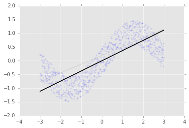


If we use the 0th and 1st expansion, that is $x^0$, which just equals 1, and $x^1$.  So $1 * W_1 + x * W_2$.  That's exactly the same as what we've just done.  It starts to get interesting once we add more powers:


```python
# Instead of a single factor and a bias, we'll create a polynomial function
# of different degrees.  We will then learn the influence that each
# degree of the input (X^0, X^1, X^2, ...) has on the final output (Y).
Y_pred = tf.Variable(tf.random_normal([1]), name='bias')
for pow_i in range(0, 4):
    W = tf.Variable(
        tf.random_normal([1], stddev=0.1), name='weight_%d' % pow_i)
    Y_pred = tf.add(tf.mul(tf.pow(X, pow_i), W), Y_pred)

# And then we'll retrain with our new Y_pred
train(X, Y, Y_pred)
```

    0.487767
    0.333574
    0.412557
    0.455543
    0.4811
    0.50941
    0.518239
    0.712861
    0.622636
    0.510807


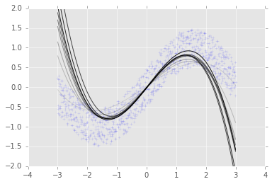


But we really don't want to add *too many* powers.  If we add just 1 more power:


```python
# Instead of a single factor and a bias, we'll create a polynomial function
# of different degrees.  We will then learn the influence that each
# degree of the input (X^0, X^1, X^2, ...) has on the final output (Y).
Y_pred = tf.Variable(tf.random_normal([1]), name='bias')
for pow_i in range(0, 5):
    W = tf.Variable(
        tf.random_normal([1], stddev=0.1), name='weight_%d' % pow_i)
    Y_pred = tf.add(tf.mul(tf.pow(X, pow_i), W), Y_pred)

# And then we'll retrain with our new Y_pred
train(X, Y, Y_pred)
```

    0.893144
    1.30899
    1.90326
    2.21289
    3.37598
    2.84538
    2.36137
    3.21127
    2.67461
    2.17921


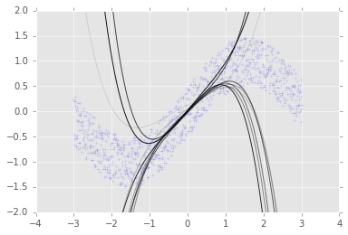


The whole thing is completely off.  In general, a polynomial expansion is hardly ever useful as it requires us to know what the underlying function is, meaning, what order polynomial is it?

<a name="introducing-nonlinearities--activation-function"></a>
## Introducing Nonlinearities / Activation Function

How else can we get our line to express the curves in our data?  What we'll explore instead is what happens when you add a non-linearity, which you might also hear be called an activation function.  That is a really essential ingredient to any deep network.  Practically every complex deep learning algorithm performs a series of linear, followed by nonlinear operations.  By stacking sets of these, the complexity and power of expression grows far greater than any linear equation could.

We'll typically make use of one of three non-linearities for the rest of this course:


```python
sess = tf.InteractiveSession()
x = np.linspace(-6,6,1000)
plt.plot(x, tf.nn.tanh(x).eval(), label='tanh')
plt.plot(x, tf.nn.sigmoid(x).eval(), label='sigmoid')
plt.plot(x, tf.nn.relu(x).eval(), label='relu')
plt.legend(loc='lower right')
plt.xlim([-6, 6])
plt.ylim([-2, 2])
plt.xlabel('Input')
plt.ylabel('Output')
plt.grid('on')
```


What each of these curves demonstrates is how instead of just multiplying an input by a number, creating another line, we *non*-linearly multiply the input value.  That just means we will multiply our input by a different value depending on what the input value is.  This allows us to express very complex ideas.  If we do this enough times, we can express anything.  Let's see how we can do this


```python
# We're going to multiply our input by 10 values, creating an "inner layer"
# of n_neurons neurons.
n_neurons = 10
W = tf.Variable(tf.random_normal([1, n_neurons]), name='W')

# and allow for n_neurons additions on each of those neurons
b = tf.Variable(tf.constant(0, dtype=tf.float32, shape=[n_neurons]), name='b')

# Instead of just multiplying, we'll put our n_neuron multiplications through a non-linearity, the tanh function.
h = tf.nn.tanh(tf.matmul(tf.expand_dims(X, 1), W) + b, name='h')

Y_pred = tf.reduce_sum(h, 1)

# And retrain w/ our new Y_pred
train(X, Y, Y_pred)
```

    2.25565
    0.276184
    0.265378
    0.260378
    0.257955
    0.256217
    0.255263
    0.254435
    0.253936
    0.253369


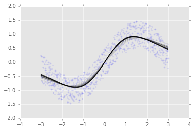


<TODO: Graphic of fully connected network, matrix>

It turns out that multiplying our input by a matrix, adding a bias, and then applying a non-linearity is something we'll need to do a lot.  It's often called a fully-connected network, since everything is connected to everything else, meaning every neuron is multiplied by every single input value.  This is also sometimes called a linear layer, since we are linearly combining the values of the input to create the resulting neuron.

You might have seen this depicted like so:


<a name="going-deeper"></a>
## Going Deeper

Let's write a simply function for creating the same type of network as above:


```python
def linear(X, n_input, n_output, activation=None):
    W = tf.Variable(tf.random_normal([n_input, n_output], stddev=0.1), name='W')
    b = tf.Variable(
        tf.constant(0, dtype=tf.float32, shape=[n_output]), name='b')
    h = tf.nn.tanh(tf.matmul(X, W) + b, name='h')
    return h
```

Let's now take a look at what the tensorflow graph looks like when we create this type of connection:


```python
# first clear the graph
from tensorflow.python.framework import ops
ops.reset_default_graph()

# let's get the current graph
g = tf.get_default_graph()

# See the names of any operations in the graph
[op.name for op in tf.get_default_graph().get_operations()]

# let's create a new network
X = tf.placeholder(tf.float32, name='X')
h = linear(X, 2, 10)

# See the names of any operations in the graph
[op.name for op in tf.get_default_graph().get_operations()]
```


    ['X',
     'random_normal/shape',
     'random_normal/mean',
     'random_normal/stddev',
     'random_normal/RandomStandardNormal',
     'random_normal/mul',
     'random_normal',
     'W',
     'W/Assign',
     'W/read',
     'Const',
     'b',
     'b/Assign',
     'b/read',
     'MatMul',
     'add',
     'h']


The names of the variables in this network aren't very helpful.  We can actually do a much better job here by creating our variables within *scopes*:


```python
def linear(X, n_input, n_output, activation=None, scope=None):
    with tf.variable_scope(scope or "linear"):
        W = tf.get_variable(
            name='W',
            shape=[n_input, n_output],
            initializer=tf.random_normal_initializer(mean=0.0, stddev=0.1))
        b = tf.get_variable(
            name='b',
            shape=[n_output],
            initializer=tf.constant_initializer())
        h = tf.matmul(X, W) + b
        if activation is not None:
            h = activation(h)
        return h
```

We've also moved from using a single random value, to using an initializer.  This initializer will create a new random value every time we call `sess.run(tf.initialize_all_variables())`.  We also pass some more sensible values for the initial mean and standard deviation.

Now let's look at the graph:


```python
# first clear the graph
from tensorflow.python.framework import ops
ops.reset_default_graph()

# let's get the current graph
g = tf.get_default_graph()

# See the names of any operations in the graph
[op.name for op in tf.get_default_graph().get_operations()]

# let's create a new network
X = tf.placeholder(tf.float32, name='X')
h = linear(X, 2, 10, scope='layer1')

# See the names of any operations in the graph
[op.name for op in tf.get_default_graph().get_operations()]
```


    ['X',
     'layer1/W',
     'layer1/W/Initializer/random_normal/shape',
     'layer1/W/Initializer/random_normal/mean',
     'layer1/W/Initializer/random_normal/stddev',
     'layer1/W/Initializer/random_normal/RandomStandardNormal',
     'layer1/W/Initializer/random_normal/mul',
     'layer1/W/Initializer/random_normal',
     'layer1/W/Assign',
     'layer1/W/read',
     'layer1/b',
     'layer1/b/Initializer/Const',
     'layer1/b/Assign',
     'layer1/b/read',
     'layer1/MatMul',
     'layer1/add']


We can see that everything that is part of creating a linear connection is under the scoped tag we have given it.

If we create multiple linear connections, this becomes really useful for understanding what's in our graph:


```python
# Let's connect the output of our last network to another one!

# Wow we just made a Deep Network!  Let's make it deeper!
h2 = linear(h, 10, 10, scope='layer2')

# Again!
h3 = linear(h2, 10, 3, scope='layer3')

# Now when we look at the names of the operations in the graph, we can directly see which operations belong to each layer!
[op.name for op in tf.get_default_graph().get_operations()]
```


    ['X',
     'layer1/W',
     'layer1/W/Initializer/random_normal/shape',
     'layer1/W/Initializer/random_normal/mean',
     'layer1/W/Initializer/random_normal/stddev',
     'layer1/W/Initializer/random_normal/RandomStandardNormal',
     'layer1/W/Initializer/random_normal/mul',
     'layer1/W/Initializer/random_normal',
     'layer1/W/Assign',
     'layer1/W/read',
     'layer1/b',
     'layer1/b/Initializer/Const',
     'layer1/b/Assign',
     'layer1/b/read',
     'layer1/MatMul',
     'layer1/add',
     'layer2/W',
     'layer2/W/Initializer/random_normal/shape',
     'layer2/W/Initializer/random_normal/mean',
     'layer2/W/Initializer/random_normal/stddev',
     'layer2/W/Initializer/random_normal/RandomStandardNormal',
     'layer2/W/Initializer/random_normal/mul',
     'layer2/W/Initializer/random_normal',
     'layer2/W/Assign',
     'layer2/W/read',
     'layer2/b',
     'layer2/b/Initializer/Const',
     'layer2/b/Assign',
     'layer2/b/read',
     'layer2/MatMul',
     'layer2/add',
     'layer3/W',
     'layer3/W/Initializer/random_normal/shape',
     'layer3/W/Initializer/random_normal/mean',
     'layer3/W/Initializer/random_normal/stddev',
     'layer3/W/Initializer/random_normal/RandomStandardNormal',
     'layer3/W/Initializer/random_normal/mul',
     'layer3/W/Initializer/random_normal',
     'layer3/W/Assign',
     'layer3/W/read',
     'layer3/b',
     'layer3/b/Initializer/Const',
     'layer3/b/Assign',
     'layer3/b/read',
     'layer3/MatMul',
     'layer3/add']


<TODO: Also, we can visualize our network using Tensorboard...>

<a name="image-inpainting"></a>
# Image Inpainting

<a name="description"></a>
## Description

Now we've got most of the tools we'll need to perform much more complicated tasks.  We'll first explore a fun application: painting an image.  This network is just meant to demonstrate how the previous networks we've learned can be scaled to more complicated tasks without much modification.

We'll follow an example that Andrej Karpathy has done in his online demonstration of "image inpainting".  Let's first get an image that we'll try to teach a neural network to paint.


```python
from skimage.data import astronaut
from scipy.misc import imresize
img = imresize(astronaut(), (64, 64))
plt.imshow(img)
```


    <matplotlib.image.AxesImage at 0x1166ffdd8>


Instead of using a network to go from some x position to the value of a sine wave, what we're going to do instead teach a network to go from the location on an image frame to a particular color.  So given any position in an image, the network will need to learn what color to paint.  Despite the seeming complexity of this task, it is remarkably similar to what we've just done.  Let's take a look.


```python
# We'll first collect all the positions in the image in our list, xs
xs = []

# And the corresponding colors for each of these positions
ys = []

# Now loop over the image
for row_i in range(img.shape[0]):
    for col_i in range(img.shape[1]):
        # And store the inputs
        xs.append([row_i, col_i])
        # And outputs that the network needs to learn to predict
        ys.append(img[row_i, col_i])

# we'll convert our lists to arrays
xs = np.array(xs)
ys = np.array(ys)

# Normalizing the input by the mean and standard deviation
xs = (xs - np.mean(xs)) / np.std(xs)

# and print the shapes
xs.shape, ys.shape
```


    ((4096, 2), (4096, 3))


What we're going to do is use regression to predict the value of a pixel given its (row, col) position.  So the input to our network is `X = (row, col)` value.  And the output of the network is `Y = (r, g, b)`.

We can get our original image back by reshaping the colors back into the original image shape:


```python
plt.imshow(ys.reshape(img.shape))
```


    <matplotlib.image.AxesImage at 0x11682cc50>


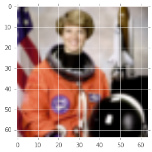


Remember before, we were using regression to input to our network `X = x`, and output `Y = y`.  The only thing that is changing here is the number of values in our input and output, and what they represent to us.  But Tensorflow can handle any number of values we give it, so this is actually a pretty simple modification to the network definition.  We'll stick with the convention of using the variable `X` to denote the input to the network, and `Y` to denote the output of the network.


```python
X = tf.placeholder(tf.float32, shape=[None, 2], name='X')
Y = tf.placeholder(tf.float32, shape=[None, 3], name='Y')
```

<a name="building-the-network"></a>
## Building the Network

For our model, we'll make our first deep neural network!  Instead of having a single fully connected layer, we'll have many layers.  We'll make use of a for loop to simplify the creation of the network. The network will look like:

<TODO: wacom/motion-graphic>


```python
n_neurons = [2, 64, 64, 64, 64, 64, 64, 3]

current_input = X
for layer_i in range(1, len(n_neurons)):
    current_input = linear(
        X=current_input,
        n_input=n_neurons[layer_i - 1],
        n_output=n_neurons[layer_i],
        activation=tf.nn.relu if (layer_i+1) < len(n_neurons) else None,
        scope='layer_' + str(layer_i))
Y_pred = current_input
```

The rest of this code is pretty much the same as what we've done in previous networks.  We setup our cost.  Except before, we only ever had 1 feature.  In this network, our output is 3 vaules, `r`, `g`, `b`.

<a name="training"></a>
## Training

In order to better measure the error, we'll sum the error across all 3 values.  There are many ways we could have approached this which we'll get into in later sessions.


```python
cost = tf.reduce_mean(
    tf.reduce_sum(distance(Y_pred, Y), 1))
```

We're going to use a different type of optimizer called `AdamOptimizer` which in general will work better than the original `GradientDescentOptimizer`.  It's pretty similar, except it has some tricks to help with gradient descent.  Getting into the details of it is beyond the scope of what we have time for.  So long as you're not working with sequential data or building a recurrent network, it will probably always work better than just using GradientDescent.


```python
optimizer = tf.train.AdamOptimizer(0.001).minimize(cost)
```

The rest of the code is pretty much the same.  We create the optimizer exactly the same way, by giving it our cost.  And then create a session to iterate over chunks of our training data.  Every 10 iterations, we're going to draw the predicted image by evaluating the predicted image tensor, `Y_pred`, and giving it every location in the image to predict, the `xs` array.  This will return us the predicted color values for those locations.  This process will take awhile!


```python
n_iterations = 500
batch_size = 50
with tf.Session() as sess:
    # Here we tell tensorflow that we want to initialize all
    # the variables in the graph so we can use them
    # This will set W and b to their initial random normal value.
    sess.run(tf.initialize_all_variables())

    # We now run a loop over epochs
    prev_training_cost = 0.0
    for it_i in range(n_iterations):
        idxs = np.random.permutation(range(len(xs)))
        n_batches = len(idxs) // batch_size
        for batch_i in range(n_batches):
            idxs_i = idxs[batch_i * batch_size: (batch_i + 1) * batch_size]
            sess.run(optimizer, feed_dict={X: xs[idxs_i], Y: ys[idxs_i]})

        training_cost = sess.run(cost, feed_dict={X: xs, Y: ys})
        print(it_i, training_cost)

        if (it_i + 1) % 20 == 0:
            ys_pred = Y_pred.eval(feed_dict={X: xs}, session=sess)
            fig, ax = plt.subplots(1, 1)
            img = np.clip(ys_pred.reshape(img.shape), 0, 255).astype(np.uint8)
            plt.imshow(img)
            plt.show()
```

    Exception ignored in: <bound method InteractiveSession.__del__ of <tensorflow.python.client.session.InteractiveSession object at 0x114655588>>
    Traceback (most recent call last):
      File "/Users/pkmital/.pyenv/versions/3.4.0/Python.framework/Versions/3.4/lib/python3.4/site-packages/tensorflow/python/client/session.py", line 171, in __del__
        self.close()
      File "/Users/pkmital/.pyenv/versions/3.4.0/Python.framework/Versions/3.4/lib/python3.4/site-packages/tensorflow/python/client/session.py", line 976, in close
        self._default_session.__exit__(None, None, None)
      File "/Users/pkmital/.pyenv/versions/3.4.0/Python.framework/Versions/3.4/lib/python3.4/contextlib.py", line 66, in __exit__
        next(self.gen)
      File "/Users/pkmital/.pyenv/versions/3.4.0/Python.framework/Versions/3.4/lib/python3.4/site-packages/tensorflow/python/framework/ops.py", line 3378, in get_controller
        % type(default))
    AssertionError: Nesting violated for default stack of <class 'weakref'> objects


    0 171.677
    1 161.184
    2 155.793
    3 150.763
    4 147.133
    5 145.1
    6 142.396
    7 140.522
    8 139.768
    9 138.98
    10 137.933
    11 136.241
    12 134.717
    13 128.992
    14 119.375
    15 118.999
    16 115.502
    17 115.767
    18 117.495
    19 112.487


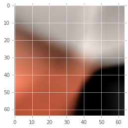


    20 114.638
    21 110.065
    22 117.791
    23 110.323
    24 108.586
    25 109.093
    26 108.244
    27 108.887
    28 108.525
    29 105.701
    30 109.888
    31 105.045
    32 104.277
    33 114.774
    34 105.151
    35 102.53
    36 103.33
    37 100.916
    38 100.125
    39 100.253


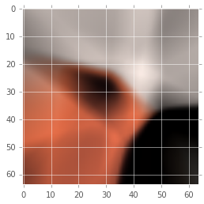


    40 100.044
    41 99.0581
    42 98.1536
    43 100.673
    44 97.4102
    45 97.3522
    46 98.2203
    47 97.1417
    48 94.4815
    49 96.8409
    50 92.9672
    51 94.8899
    52 98.6099
    53 94.9889
    54 96.1282
    55 94.3528
    56 91.4356
    57 95.7946
    58 91.8184
    59 92.9857


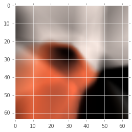


    60 90.3984
    61 89.83
    62 94.1827
    63 88.8636
    64 89.5965
    65 88.6912
    66 87.7035
    67 89.9703
    68 89.4829
    69 88.9022
    70 86.636
    71 90.4378
    72 87.1619
    73 86.3958
    74 85.5976
    75 88.77
    76 90.4436
    77 82.9005
    78 84.0674
    79 85.0644


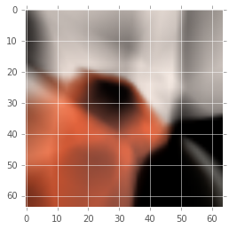


    80 84.2106
    81 87.0077
    82 83.1489
    83 85.1217
    84 82.7779
    85 80.4349
    86 79.7281
    87 79.9554
    88 80.4176
    89 85.5533
    90 80.0457
    91 80.6161
    92 79.9209
    93 83.8701
    94 79.1282
    95 78.4016
    96 90.0735
    97 81.8786
    98 78.9552
    99 81.0696


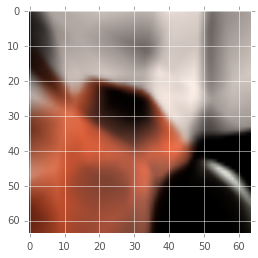


    100 75.7591
    101 78.984
    102 80.5921
    103 78.2012
    104 75.6869
    105 74.3677
    106 77.9939
    107 79.5514
    108 77.0002
    109 74.0918
    110 75.482
    111 75.2162
    112 75.4579
    113 73.4291
    114 72.2712
    115 71.8898
    116 69.6745
    117 75.8903
    118 73.0047
    119 70.9606


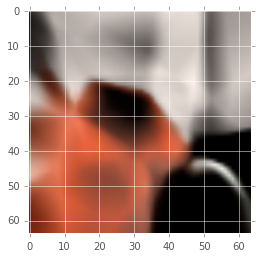


    120 73.7775
    121 70.1865
    122 70.7019
    123 72.0106
    124 73.2297
    125 70.7361
    126 70.4022
    127 72.5934
    128 72.5204
    129 73.6208
    130 71.8407
    131 73.471
    132 72.1638
    133 72.2729
    134 70.9204
    135 70.0203
    136 74.5931
    137 73.7728
    138 66.4928
    139 77.4754


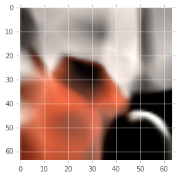


    140 73.9249
    141 67.3081
    142 68.6448
    143 66.5155
    144 67.2094
    145 67.638
    146 65.7352
    147 74.8893
    148 69.0927
    149 71.6849
    150 69.4643
    151 70.3677
    152 64.8709
    153 73.1473
    154 64.3903
    155 73.7222
    156 70.1126
    157 67.9034
    158 65.9797
    159 66.2216


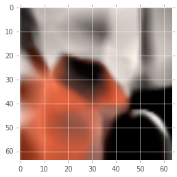


    160 66.8601
    161 66.6111
    162 68.7605
    163 69.8626
    164 63.1192
    165 65.9078
    166 64.8997
    167 67.5689
    168 63.3261
    169 64.6773
    170 65.0903
    171 64.7196
    172 63.1892
    173 63.1196
    174 63.7834
    175 66.0444
    176 65.1857
    177 65.9627
    178 66.5566
    179 67.3164


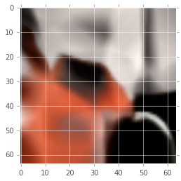


    180 64.1382
    181 66.6814
    182 60.7954
    183 65.6041
    184 67.4161
    185 65.1973
    186 71.1138
    187 68.3279
    188 61.6155
    189 66.4743
    190 63.6235
    191 60.7719
    192 62.7428
    193 61.0051
    194 62.8074
    195 63.6391
    196 62.5144
    197 65.5224
    198 62.9388
    199 62.1233


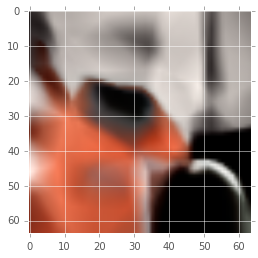


    200 60.769
    201 63.0966
    202 61.2243
    203 61.5569
    204 67.0697
    205 62.1347
    206 62.3952
    207 60.8389
    208 64.3736
    209 59.033
    210 60.8732
    211 67.9681
    212 59.8226
    213 60.6225
    214 57.4895
    215 57.6602
    216 63.1401
    217 59.3235
    218 61.1487
    219 58.1339


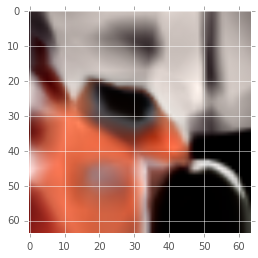


    220 58.1289
    221 62.2883
    222 60.7435
    223 57.1789
    224 57.4343
    225 63.0962
    226 58.5783
    227 59.5454
    228 61.0639
    229 63.0149
    230 59.3702
    231 58.3684
    232 59.7032
    233 58.3511
    234 57.6029
    235 62.9715
    236 56.6357
    237 56.5179
    238 56.7907
    239 58.2219


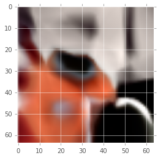


    240 56.1587
    241 55.4927
    242 57.8357
    243 56.4158
    244 55.342
    245 54.9228
    246 61.6374
    247 55.2351
    248 55.8407
    249 60.7614
    250 56.898
    251 55.044
    252 55.5807
    253 52.6826
    254 56.8
    255 60.7951
    256 55.0217
    257 59.416
    258 53.659
    259 55.4594


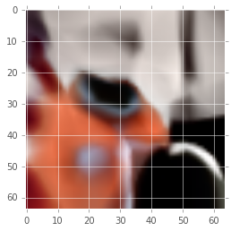


    260 56.5406
    261 54.7553
    262 58.6049
    263 62.3806
    264 57.2909
    265 53.5952
    266 56.8543
    267 59.3189
    268 61.9737
    269 64.6039
    270 57.053
    271 55.6585
    272 55.7749
    273 54.8484
    274 56.1359
    275 59.3683
    276 55.1523
    277 55.5535
    278 52.4235
    279 52.6681


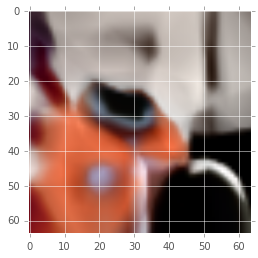


    280 57.1377
    281 56.9011
    282 55.1262
    283 54.9015
    284 55.8373
    285 52.7994
    286 56.0188
    287 50.2731
    288 52.6615
    289 51.9585
    290 50.9439
    291 50.6619
    292 50.4731
    293 52.6944
    294 50.9951
    295 52.4898
    296 50.2949
    297 56.1079
    298 61.8075
    299 55.5163


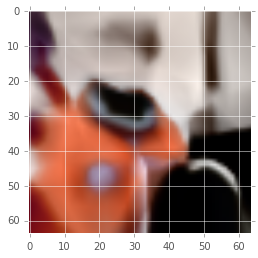


    300 52.194
    301 51.2732
    302 59.1071
    303 54.7632
    304 49.8127
    305 50.3864
    306 52.0749
    307 53.9276
    308 52.3939
    309 48.8659
    310 49.1355
    311 53.1441
    312 50.1204
    313 49.9477
    314 50.4059
    315 57.8662
    316 51.6992
    317 50.1105
    318 50.8655
    319 50.481


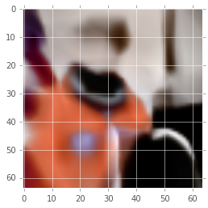


    320 55.4901
    321 50.7015
    322 48.7229
    323 55.0151
    324 50.6706
    325 56.1064
    326 50.7919
    327 50.4555
    328 52.5283
    329 53.4165
    330 48.1645
    331 49.9607
    332 51.1891
    333 51.5048
    334 50.8326
    335 52.9802
    336 52.6041
    337 52.8059
    338 47.9207
    339 49.4139


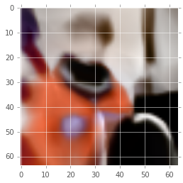


    340 50.1231
    341 54.6369
    342 51.9027
    343 47.794
    344 48.3982
    345 47.6179
    346 54.2584
    347 46.599
    348 49.433
    349 49.0016
    350 47.5594
    351 46.3275
    352 46.453
    353 49.1036
    354 46.8344
    355 47.1067
    356 47.8093
    357 48.7785
    358 47.4215
    359 50.2703


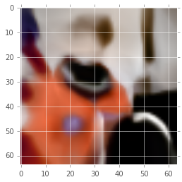


    360 44.8784
    361 51.1347
    362 49.6155
    363 46.4322
    364 48.3801
    365 48.6703
    366 49.0483
    367 44.7038
    368 56.7678
    369 47.7288
    370 47.5399
    371 45.8292
    372 51.4912
    373 48.8803
    374 44.9827
    375 46.7172
    376 45.3099
    377 46.7056
    378 48.6718
    379 45.719


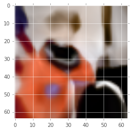


    380 45.8762
    381 45.7119
    382 48.6053
    383 45.6096
    384 44.6938
    385 44.5288
    386 52.237
    387 45.1162
    388 48.1845
    389 44.9764
    390 46.9893
    391 50.0519
    392 44.8858
    393 44.5794
    394 47.6274
    395 47.3281
    396 55.9911
    397 48.7085
    398 44.0224
    399 46.6334


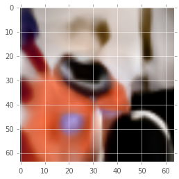


    400 45.3531
    401 44.3816
    402 46.6168
    403 45.9734
    404 44.1055
    405 48.4107
    406 44.2193
    407 47.3284
    408 45.3087
    409 45.0506
    410 43.3645
    411 44.9609
    412 46.6243
    413 43.5355
    414 47.8045
    415 45.3247
    416 44.3832
    417 45.7085
    418 46.571
    419 42.5432


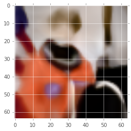


    420 42.8438
    421 44.6139
    422 43.0258
    423 42.4682
    424 45.3384
    425 43.0347
    426 47.2146
    427 46.9206
    428 41.7718
    429 44.186
    430 42.2741
    431 47.1405
    432 47.6836
    433 45.2017
    434 44.1777
    435 44.7749
    436 43.2644
    437 44.4163
    438 43.637
    439 43.7445


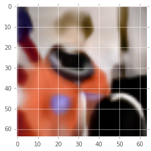


    440 44.6876
    441 42.6457
    442 51.8807
    443 42.6362
    444 50.2951
    445 42.2553
    446 42.4878
    447 42.6258
    448 42.3551
    449 45.233
    450 42.7295
    451 40.1579
    452 42.7378
    453 44.2297
    454 46.0901
    455 43.1651
    456 48.0544
    457 46.3559
    458 43.1697
    459 42.6551


    460 46.7101
    461 42.3164
    462 44.7503
    463 44.2968
    464 41.2928
    465 41.7739
    466 43.0795
    467 53.6741
    468 42.6497
    469 42.5302
    470 45.3403
    471 43.3855
    472 43.6696
    473 47.9835
    474 41.6728
    475 39.855
    476 44.6643
    477 44.6166
    478 41.4339
    479 44.1585


    480 41.9411
    481 40.0512
    482 42.1163
    483 43.0327
    484 43.6654
    485 41.7332
    486 42.4947
    487 39.8143
    488 39.687
    489 41.3526
    490 41.4163
    491 43.4381
    492 42.0374
    493 46.2219
    494 39.7897
    495 41.4738
    496 45.7813
    497 42.2814
    498 46.0093
    499 41.1277


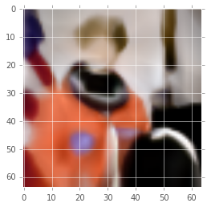


After letting this run for a few minutes, we'll see the image becoming more like the original image.

<a name="homework"></a>
# Homework:

Head over to the [notebook](session-2.ipynb) for more details.

<a name="reading"></a>
# Reading:

Cauchy, Augustin (1847). Méthode générale pour la résolution des systèmes d'équations simultanées. pp. 536–538.

H. Robinds and S. Monro, “A stochastic approximation method,” Annals of Mathematical Statistics, vol. 22, pp. 400–407, 1951. 

Sutton, R. S. (1986). Two problems with backpropagation and other steepest-descent learning procedures for networks. Proc. 8th Annual Conf. Cognitive Science Society. 

Yann Lecun. Efficient BackProp. 1998.
http://yann.lecun.com/exdb/publis/pdf/lecun-98b.pdf

Kingma, D. P., & Ba, J. L. (2015). Adam: a Method for Stochastic Optimization. International Conference on Learning Representations, 1–13.

J. Schmidhuber. Deep Learning in Neural Networks: An Overview. Neural Networks, 61, p 85-117, 2015.
